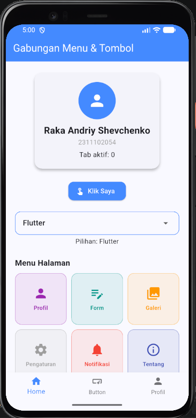
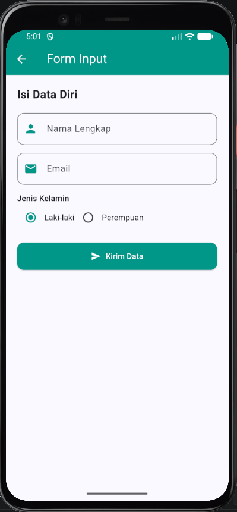
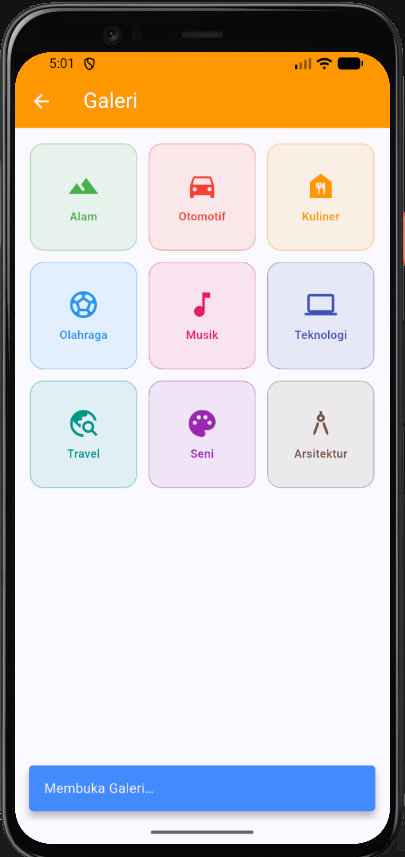
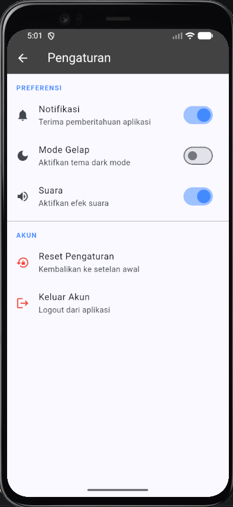
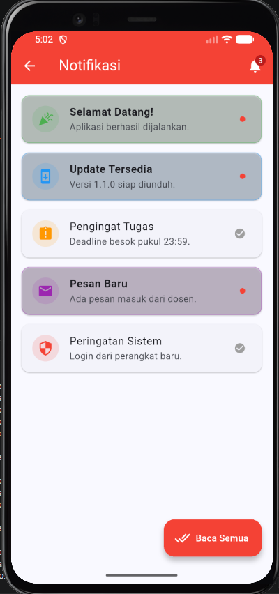
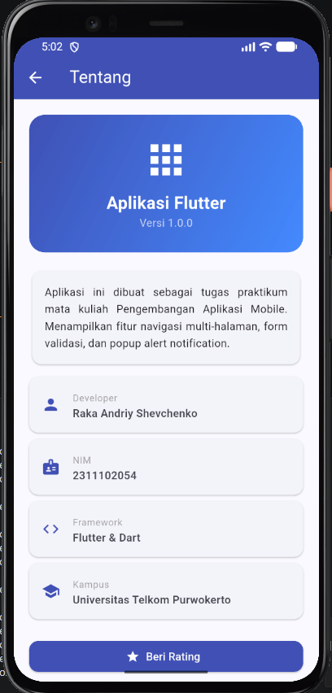
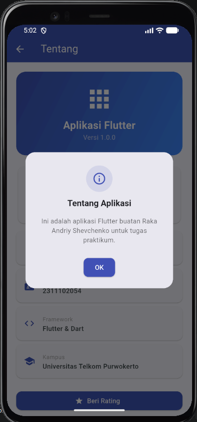

<div style="font-family: 'Times New Roman', Times, serif;">

<div align="center">
  <br />

  <h1>LAPORAN PRAKTIKUM <br>
  APLIKASI BERBASIS PLATFORM
  </h1>

  <br />

  <h3>MODUL - 7<br>
    Praktikum Flutter — Navigasi & Notifikasi (Unguided)
  </h3>

  <br />

  

  <br />
  <br />
  <br />

  <h3>Disusun Oleh :</h3>

  <p>
    <strong>Raka Andriy Shevchenko</strong><br>
    <strong>2311102054</strong><br>
    <strong>S1 IF-11-</strong>
  </p>

  <br />

  <h3>Dosen Pengampu :</h3>

  <p>
    <strong>Cahyo Prihantoro, S.Kom., M.Eng.</strong>
  </p>

  <br />

  <h3>LABORATORIUM HIGH PERFORMANCE
  <br>FAKULTAS INFORMATIKA <br>UNIVERSITAS TELKOM PURWOKERTO <br>2026</h3>
</div>

<hr>

## 1. Penjelasan Singkat

Pada tugas **Unguided Modul 7** ini, praktikum berfokus pada pembuatan **satu aplikasi Flutter** lengkap yang terdiri dari **7 halaman** dengan sistem **navigasi antar halaman** menggunakan `Navigator` dan **notifikasi popup** menggunakan `AlertDialog` serta `SnackBar`.

Konsep utama yang diterapkan:

1. **Named Routes** : Menggunakan `initialRoute` dan `routes` pada `MaterialApp` untuk mendefinisikan semua rute halaman secara terpusat, sehingga navigasi bisa dilakukan dari mana saja menggunakan `Navigator.pushNamed()`.

2. **Navigator.pushNamed()** : Navigasi ke halaman tertentu berdasarkan nama rute (string), sehingga kode lebih terstruktur dan mudah dipelihara.

3. **Popup Alert Dialog (`popupAlert`)** : Helper function reusable yang membungkus `AlertDialog` dengan tampilan ikon bulat, judul, isi pesan, serta tombol OK dan Batal yang dapat dikonfigurasi. Digunakan sebagai notifikasi utama di seluruh aplikasi.

4. **SnackBar** : Widget notifikasi ringan yang muncul di bagian bawah layar, digunakan untuk feedback singkat seperti konfirmasi reset atau perubahan state.

5. **StatefulWidget & Controller** : Pengelolaan state form menggunakan `TextEditingController` dan `GlobalKey<FormState>` untuk membaca dan memvalidasi input pengguna.

6. **`addPostFrameCallback`** : Teknik untuk menjalankan kode setelah frame pertama selesai di-render, digunakan untuk menampilkan popup otomatis saat halaman pertama kali dibuka.

---

## 2. Langkah-langkah Praktikum

### Langkah 1 — Siapkan Project Flutter

Buat atau gunakan project Flutter yang sudah ada sebagai base project dengan struktur standar Flutter:

```
project/
├── lib/
│   └── main.dart
├── pubspec.yaml
└── ...
```

---

### Langkah 2 — Konfigurasi Named Routes di `main.dart`

Edit file `lib/main.dart` untuk mendefinisikan semua named routes dan helper function `popupAlert`:


```dart
void main() => runApp(const MyApp());

class MyApp extends StatelessWidget {
  const MyApp({super.key});

  @override
  Widget build(BuildContext context) {
    return MaterialApp(
      debugShowCheckedModeBanner: false,
      theme: ThemeData(colorSchemeSeed: Colors.blueAccent, useMaterial3: true),
      initialRoute: '/',
      routes: {
        '/':           (ctx) => const HalamanUtama(),
        '/profil':     (ctx) => const HalamanProfil(),
        '/form':       (ctx) => const HalamanForm(),
        '/galeri':     (ctx) => const HalamanGaleri(),
        '/pengaturan': (ctx) => const HalamanPengaturan(),
        '/notifikasi': (ctx) => const HalamanNotifikasi(),
        '/tentang':    (ctx) => const HalamanTentang(),
      },
    );
  }
}
```

---

### Langkah 3 — Buat Helper `popupAlert`

Fungsi helper reusable untuk menampilkan popup alert di seluruh aplikasi. Fungsi ini menerima parameter `judul`, `isi`, `icon`, `iconColor`, serta opsional `tombolBatal` dan callback `onOk`:

```dart
Future<void> popupAlert(
  BuildContext ctx, {
  required String judul,
  required String isi,
  IconData icon = Icons.info_outline,
  Color iconColor = Colors.blueAccent,
  String tombolOk = 'OK',
  String? tombolBatal,
  VoidCallback? onOk,
}) {
  return showDialog(
    context: ctx,
    barrierDismissible: false,
    builder: (_) => AlertDialog(
      shape: RoundedRectangleBorder(borderRadius: BorderRadius.circular(20)),
      title: Column(children: [
        CircleAvatar(radius: 28, backgroundColor: iconColor.withOpacity(.12),
            child: Icon(icon, color: iconColor, size: 30)),
        const SizedBox(height: 12),
        Text(judul, textAlign: TextAlign.center,
            style: const TextStyle(fontSize: 18, fontWeight: FontWeight.bold)),
      ]),
      content: Text(isi, textAlign: TextAlign.center),
      actions: [
        if (tombolBatal != null)
          OutlinedButton(onPressed: () => Navigator.pop(ctx), child: Text(tombolBatal)),
        ElevatedButton(
          onPressed: () { Navigator.pop(ctx); onOk?.call(); },
          child: Text(tombolOk),
        ),
      ],
    ),
  );
}
```

---

### Langkah 4 — Buat Halaman Utama / Home

Halaman utama menampilkan kartu identitas, tombol, dropdown, dan grid menu navigasi ke 6 halaman. Setiap interaksi memunculkan **popup alert**:


```dart
void _goto(String route, String label) {
  Navigator.pushNamed(context, route);
  snack(context, 'Membuka $label…');
}
```

Saat tombol "Klik Saya" ditekan, muncul popup konfirmasi:

```dart
onPressed: () => popupAlert(context,
  judul: 'Button Ditekan!',
  isi: 'Kamu berhasil menekan tombol ini.',
  icon: Icons.check_circle,
  iconColor: Colors.green,
),
```

---

### Langkah 5 — Buat Halaman Profil

Menampilkan data diri mahasiswa dalam bentuk kartu informasi. **Popup alert otomatis** muncul saat halaman pertama kali dibuka menggunakan `addPostFrameCallback`:


```dart
WidgetsBinding.instance.addPostFrameCallback((_) => popupAlert(context,
  judul: 'Selamat Datang!',
  isi: 'Kamu membuka halaman Profil.',
  icon: Icons.waving_hand, iconColor: Colors.purple,
));
```

---

### Langkah 6 — Buat Halaman Form Input

Halaman form dengan validasi dua field (Nama dan Email) serta pilihan radio gender. Popup alert muncul saat validasi gagal maupun berhasil:


```dart
void _submit() {
  if (!_key.currentState!.validate()) {
    popupAlert(context,
      judul: 'Form Tidak Lengkap',
      isi: 'Harap isi semua field yang wajib diisi sebelum mengirim.',
      icon: Icons.warning_amber_rounded, iconColor: Colors.red,
    );
    return;
  }
  popupAlert(context,
    judul: 'Data Terkirim!',
    isi: 'Nama: ${_nama.text}\nEmail: ${_email.text}\nGender: $_gender',
    icon: Icons.check_circle, iconColor: Colors.teal,
    tombolBatal: 'Tutup', tombolOk: 'Reset Form',
    onOk: () { _nama.clear(); _email.clear(); },
  );
}
```

---

### Langkah 7 — Buat Halaman Galeri

Menampilkan grid 9 kategori galeri. Setiap item yang ditekan memunculkan **popup alert** dengan ikon dan warna sesuai kategori:


```dart
onTap: () => popupAlert(context,
  judul: r[1] as String,
  isi: 'Kamu membuka kategori "${r[1]}".\nFitur galeri lengkap segera hadir!',
  icon: r[0] as IconData, iconColor: color,
),
```

---

### Langkah 8 — Buat Halaman Pengaturan

Menampilkan tiga toggle switch (Notifikasi, Mode Gelap, Suara) serta opsi Reset dan Logout. Setiap toggle menampilkan **popup alert** berisi status aktif/nonaktif. Tombol Reset dan Logout memunculkan **popup konfirmasi** dengan tombol Batal dan OK:


```dart
onChanged: (v) {
  setState(() => cb(v));
  popupAlert(context,
    judul: title,
    isi: '$title telah ${v ? "diaktifkan" : "dinonaktifkan"}.',
    icon: v ? Icons.check_circle : Icons.cancel,
    iconColor: v ? Colors.green : Colors.grey,
  );
},
```

---

### Langkah 9 — Buat Halaman Notifikasi

Menampilkan daftar notifikasi yang bisa dibuka (memunculkan popup), ditandai dibaca, dan dihapus dengan swipe. Swipe kiri memunculkan **popup konfirmasi** sebelum menghapus:


```dart
confirmDismiss: (_) async {
  bool konfirm = false;
  await popupAlert(ctx,
    judul: 'Hapus Notifikasi?',
    isi: 'Notifikasi "${n['judul']}" akan dihapus permanen.',
    icon: Icons.delete_forever, iconColor: Colors.red,
    tombolBatal: 'Batal', tombolOk: 'Hapus',
    onOk: () => konfirm = true,
  );
  return konfirm;
},
```

---

### Langkah 10 — Buat Halaman Tentang

Menampilkan informasi aplikasi dan developer. **Popup otomatis** muncul saat halaman dibuka, serta popup konfirmasi saat tombol "Beri Rating" ditekan:


```dart
WidgetsBinding.instance.addPostFrameCallback((_) => popupAlert(context,
  judul: 'Tentang Aplikasi',
  isi: 'Ini adalah aplikasi Flutter buatan Raka Andriy Shevchenko untuk tugas praktikum.',
  icon: Icons.info_outline, iconColor: Colors.indigo,
));
```

---

## 3. Struktur File

Seluruh kode ditulis dalam satu file `main.dart`:

```
project/
├── lib/
│   └── main.dart         ← semua halaman & helper dalam satu file
├── pubspec.yaml
└── ...
```

`main.dart` terdiri dari:

```
main.dart
├── MyApp              — root widget & route definitions
├── snack()            — helper SnackBar ringan
├── popupAlert()       — helper Popup Alert Dialog reusable
├── HalamanUtama       — Halaman 1: Home + grid menu + dropdown
├── HalamanProfil      — Halaman 2: Data diri mahasiswa
├── HalamanForm        — Halaman 3: Form input + validasi
├── HalamanGaleri      — Halaman 4: Grid 9 kategori galeri
├── HalamanPengaturan  — Halaman 5: Toggle switch + reset/logout
├── HalamanNotifikasi  — Halaman 6: Daftar notifikasi + swipe hapus
└── HalamanTentang     — Halaman 7: Info aplikasi & developer
```

---

## 4. Source Code Lengkap

### 4.1 Helper Functions

```dart
void snack(BuildContext ctx, String msg, {Color color = Colors.blueAccent}) =>
    ScaffoldMessenger.of(ctx).showSnackBar(SnackBar(
      content: Text(msg), backgroundColor: color,
      behavior: SnackBarBehavior.floating,
      duration: const Duration(seconds: 1),
    ));

Future<void> popupAlert(
  BuildContext ctx, {
  required String judul,
  required String isi,
  IconData icon = Icons.info_outline,
  Color iconColor = Colors.blueAccent,
  String tombolOk = 'OK',
  String? tombolBatal,
  VoidCallback? onOk,
}) {
  return showDialog(
    context: ctx,
    barrierDismissible: false,
    builder: (_) => AlertDialog(
      shape: RoundedRectangleBorder(borderRadius: BorderRadius.circular(20)),
      titlePadding: const EdgeInsets.fromLTRB(24, 28, 24, 0),
      title: Column(children: [
        CircleAvatar(radius: 28, backgroundColor: iconColor.withOpacity(.12),
            child: Icon(icon, color: iconColor, size: 30)),
        const SizedBox(height: 12),
        Text(judul, textAlign: TextAlign.center,
            style: const TextStyle(fontSize: 18, fontWeight: FontWeight.bold)),
      ]),
      content: Text(isi, textAlign: TextAlign.center,
          style: const TextStyle(fontSize: 14, color: Colors.black54)),
      actionsAlignment: MainAxisAlignment.center,
      actionsPadding: const EdgeInsets.fromLTRB(24, 0, 24, 20),
      actions: [
        if (tombolBatal != null)
          OutlinedButton(
            style: OutlinedButton.styleFrom(
                side: BorderSide(color: iconColor),
                shape: RoundedRectangleBorder(borderRadius: BorderRadius.circular(10))),
            onPressed: () => Navigator.pop(ctx),
            child: Text(tombolBatal, style: TextStyle(color: iconColor)),
          ),
        ElevatedButton(
          style: ElevatedButton.styleFrom(
              backgroundColor: iconColor, foregroundColor: Colors.white,
              shape: RoundedRectangleBorder(borderRadius: BorderRadius.circular(10))),
          onPressed: () { Navigator.pop(ctx); onOk?.call(); },
          child: Text(tombolOk),
        ),
      ],
    ),
  );
}
```

---

## 5. Ringkasan Notifikasi

| No | Halaman | Jenis Notifikasi | Trigger |
|:---:|:---|:---:|:---|
| 1 | Home | Popup Alert (hijau) | Tombol "Klik Saya" ditekan |
| 1 | Home | Popup Alert (indigo) | Dropdown diubah |
| 1 | Home | Popup Alert (biru) | Tab BottomNavigationBar ditekan |
| 1 | Home | SnackBar (biru) | Item grid menu ditekan — konfirmasi navigasi |
| 2 | Profil | Popup Alert (ungu) | Otomatis saat halaman pertama kali dibuka |
| 2 | Profil | Popup Alert (ungu) | Tombol "Edit Profil" ditekan |
| 3 | Form | Popup Alert (merah) | Validasi gagal — field kosong atau email tidak valid |
| 3 | Form | Popup Alert (teal) | Data valid — menampilkan ringkasan input |
| 4 | Galeri | Popup Alert (warna kategori) | Setiap item grid diklik |
| 5 | Pengaturan | Popup Alert (hijau/abu) | Setiap toggle switch diubah |
| 5 | Pengaturan | Popup Alert (merah) | Tombol Reset Pengaturan ditekan |
| 5 | Pengaturan | Popup Alert (merah) | Tombol Logout ditekan |
| 6 | Notifikasi | Popup Alert (warna notif) | Item notifikasi dibuka/diklik |
| 6 | Notifikasi | Popup Alert (merah) | Konfirmasi sebelum menghapus dengan swipe |
| 6 | Notifikasi | Popup Alert (merah) | Tombol "Baca Semua" ditekan |
| 7 | Tentang | Popup Alert (indigo) | Otomatis saat halaman pertama kali dibuka |
| 7 | Tentang | Popup Alert (kuning) | Tombol "Beri Rating" ditekan |

---

## 6. Cara Menjalankan

1. Buka terminal di folder project.
2. Pastikan dependencies sudah terinstal:
   ```bash
   flutter pub get
   ```
3. Jalankan aplikasi:
   ```bash
   flutter run
   ```
4. Navigasi dari halaman Home ke setiap halaman untuk melihat notifikasi popup.

---

## 7. Screenshot Hasil Tampilan

<br>

<div align="center">

| No | Deskripsi | Screenshot |
|:---:|:---|:---:|
| 1 | Home — Grid menu navigasi |  |
| 2 | Profil — Menu Profil |  |
| 3 | Form — Menu Form |  |
| 4 | Galeri — Galeri per kategori |  |
| 5 | Pengaturan — Menu Setting|  |
| 6 | Notifikasi — Menu Notifikasi |  |
| 7 | Tentang — Menu About |  |
| 8 | Tentang — Popup otomatis saat masuk |  |

</div>

<br>

---

## 8. Kesimpulan

Pada praktikum Unguided Modul 7 ini, berhasil diimplementasikan:

1. **Navigasi antar halaman** menggunakan **Named Routes** (`initialRoute` + `routes`) di `MaterialApp`, sehingga semua rute terdefinisi terpusat dan dapat dipanggil dari mana saja dengan `Navigator.pushNamed()`.

2. **7 halaman total** — 1 halaman Utama sebagai pusat navigasi, ditambah 6 halaman fungsional: Profil, Form Input, Galeri, Pengaturan, Notifikasi, dan Tentang.

3. **Helper function `popupAlert`** yang reusable dan dapat dikonfigurasi (ikon, warna, judul, isi, tombol), sehingga tampilan popup konsisten di seluruh aplikasi tanpa duplikasi kode.

4. **Sistem notifikasi popup** yang bervariasi sesuai konteks:
   - **Popup informatif** (satu tombol OK) untuk feedback dan konfirmasi aksi.
   - **Popup konfirmasi** (tombol Batal + OK) untuk aksi destruktif seperti hapus notifikasi, reset pengaturan, dan logout.
   - **Popup otomatis** menggunakan `addPostFrameCallback` saat halaman pertama kali dibuka.

5. **Validasi form** pada halaman Form Input memberikan pesan error yang spesifik sesuai kondisi (field kosong, format email tidak valid).

6. **Dismissible dengan konfirmasi popup** pada halaman Notifikasi, memastikan pengguna tidak menghapus notifikasi secara tidak sengaja.

</div>
