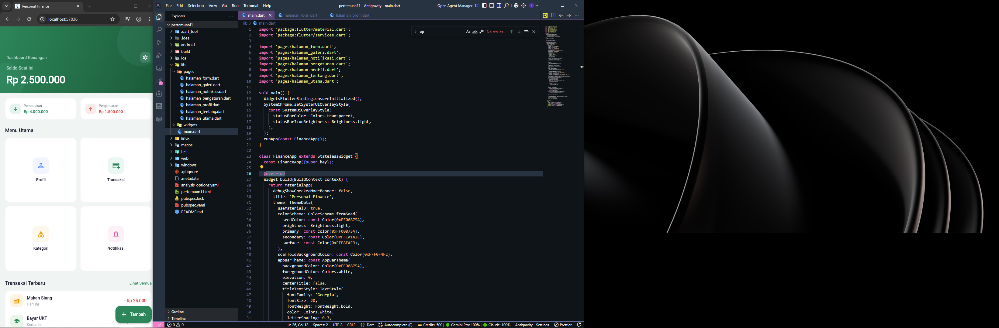
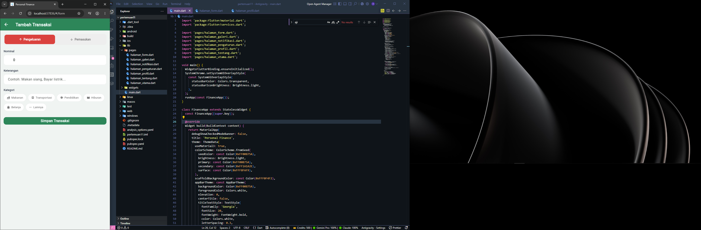
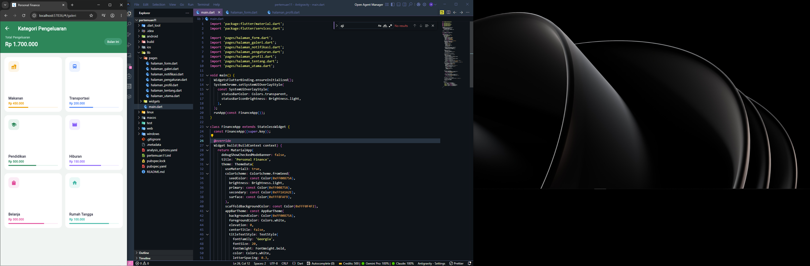
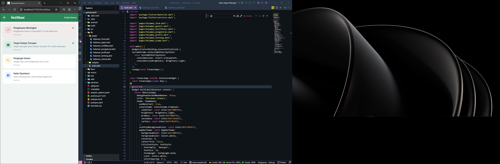
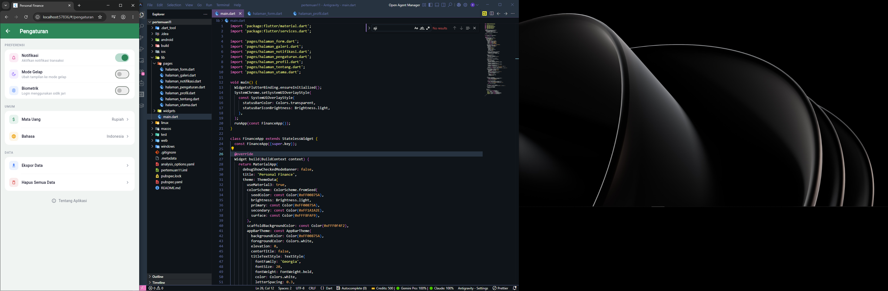
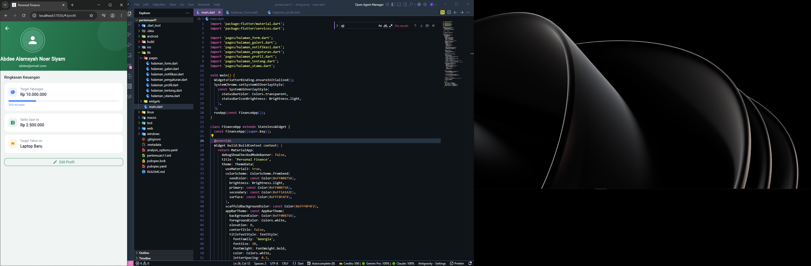

# LAPORAN PRAKTIKUM
## PENGEMBANGAN APLIKASI BERBASIS PLATFORM (ABP)
### PERTEMUAN 11: NAVIGASI, ROUTING, FORM VALIDASI, DAN CUSTOM WIDGET PADA FLUTTER

---

### IDENTITAS MAHASISWA
* **Nama:** Abdee Alamsyah Noer Siyam
* **NIM:** 2311102247
* **Kelas:** S1-IF11-04
* **Program Studi:** S1 Teknik Informatika
* **Fakultas:** Rekayasa Industri dan Desain
* **Kampus:** Telkom University Purwokerto

---

## 1. Deskripsi Project
Project ini merupakan aplikasi **Personal Finance** (Manajemen Keuangan Pribadi) berbasis Flutter. Aplikasi dirancang untuk membantu pengguna mengelola pemasukan dan pengeluaran secara mandiri, lengkap dengan pencatatan transaksi, ringkasan saldo, kategorisasi pengeluaran, sistem notifikasi, preferensi pengguna (seperti mode gelap dan biometrik), serta halaman profil dan informasi pengembang.

Aplikasi ini mengimplementasikan konsep-konsep inti Flutter dari Pertemuan 11, yaitu:
1. **Named Routing & Navigation:** Alur navigasi antar-halaman menggunakan penamaan rute yang dikelola terpusat di `main.dart`.
2. **Form Validation:** Form interaktif untuk menambah transaksi baru dengan validasi field input yang aman.
3. **Custom Reusable Widgets:** Penerapan widget modular seperti `MenuCard` guna menjaga kode tetap bersih (*clean code*) dan terorganisir.
4. **Stateful Widget Management:** Penggunaan state lokal (`setState`) untuk menangani interaksi pengguna seperti *toggle switch*, pemilihan kategori, bottom sheet picker, dan dismissible notifications.

---

## 2. Struktur Direktori
Berikut adalah struktur direktori dari folder `lib` pada project ini:
```text
lib/
├── main.dart
├── pages/
│   ├── halaman_form.dart
│   ├── halaman_galeri.dart
│   ├── halaman_notifikasi.dart
│   ├── halaman_pengaturan.dart
│   ├── halaman_profil.dart
│   ├── halaman_tentang.dart
│   └── halaman_utama.dart
└── widgets/
    └── menu_card.dart
```

---

## 3. Dokumentasi User Interface (UI)
Berikut adalah visualisasi antarmuka aplikasi **Personal Finance** yang telah diimplementasikan:

| **Dashboard (Halaman Utama)** | **Tambah Transaksi (Form)** |
|:---:|:---:|
|  |  |
| Menampilkan saldo saat ini, total pemasukan & pengeluaran, grid menu utama, serta daftar transaksi terbaru. | Form interaktif dengan validasi input nominal, keterangan, serta pemilihan kategori transaksi. |

| **Kategori Pengeluaran (Galeri)** | **Notifikasi** |
|:---:|:---:|
|  |  |
| Menampilkan daftar kategori pengeluaran lengkap dengan persentase pemakaian dalam bentuk *progress bar*. | Notifikasi aplikasi dengan fitur *swipe-to-dismiss* (geser untuk menghapus) dan penanda baca. |

| **Pengaturan (Settings)** | **Profil Pengguna** |
|:---:|:---:|
|  |  |
| Mengatur preferensi sistem (Notifikasi, Mode Gelap, Biometrik), pilihan mata uang melalui bottom sheet, dan opsi data. | Menampilkan informasi pengguna beserta ringkasan finansial seperti target tabungan tahunan. |

---

## 4. Penjelasan Detail Halaman & Komponen

### A. Konfigurasi Routing (`main.dart`)
Semua halaman didaftarkan sebagai rute bernama (*named routes*) di dalam `MaterialApp`. Hal ini memudahkan pemanggilan rute dari halaman mana pun secara terstruktur.
```dart
initialRoute: '/',
routes: {
  '/': (context) => const HalamanUtama(),
  '/profil': (context) => const HalamanProfil(),
  '/form': (context) => const HalamanForm(),
  '/galeri': (context) => const HalamanGaleri(),
  '/pengaturan': (context) => const HalamanPengaturan(),
  '/notifikasi': (context) => const HalamanNotifikasi(),
  '/tentang': (context) => const HalamanTentang(),
},
```

### B. Halaman Utama (`halaman_utama.dart`)
Merupakan dashboard utama aplikasi. Menggunakan `CustomScrollView` dengan `SliverAppBar` bergradien untuk memberikan tampilan visual yang modern. 
* **Fitur Utama:**
  * Menampilkan total saldo, total pemasukan, dan total pengeluaran.
  * Navigasi cepat menggunakan widget grid `MenuCard`.
  * Daftar transaksi terbaru yang divisualisasikan dengan list tile kustom.
  * `FloatingActionButton` untuk menambahkan transaksi dengan cepat.

### C. Halaman Form Transaksi (`halaman_form.dart`)
Form interaktif yang digunakan untuk mencatat pengeluaran atau pemasukan baru.
* **Fitur Utama:**
  * **Toggle Kustom:** Switch animasi untuk memilih tipe transaksi (Pengeluaran berwarna merah, Pemasukan berwarna hijau).
  * **Validasi Form:** Validasi input nominal dan keterangan dengan `GlobalKey<FormState>`. Jika kosong, input akan menampilkan pesan error secara langsung.
  * **Category Selector Chips:** Memilih kategori (Makanan, Transportasi, Pendidikan, dll.) menggunakan susunan widget `Wrap` dan dekorasi chip dinamis.
  * **Feedback User:** Menampilkan `SnackBar` mengambang (*floating*) bernuansa hijau ketika transaksi berhasil disimpan.

### D. Halaman Kategori (`halaman_galeri.dart`)
Menampilkan ringkasan alokasi pengeluaran berdasarkan kategori masing-masing.
* **Fitur Utama:**
  * Banner total pengeluaran bulanan.
  * GridView yang berisi kartu visual dari kategori pengeluaran.
  * `LinearProgressIndicator` kustom yang merepresentasikan persentase pemakaian dana untuk setiap kategori.

### E. Halaman Notifikasi (`halaman_notifikasi.dart`)
Mengelola pesan pengingat finansial bagi pengguna.
* **Fitur Utama:**
  * Deteksi jumlah notifikasi belum dibaca (*unread count*).
  * Tombol aksi "Tandai Semua Dibaca" pada AppBar untuk mengubah state semua notifikasi secara instan.
  * **Swipe-to-Dismiss:** Menggunakan widget `Dismissible` sehingga pengguna bisa menggeser kartu notifikasi ke kiri untuk menghapusnya secara interaktif dengan konfirmasi SnackBar (terdapat tombol "Batal").

### F. Halaman Pengaturan (`halaman_pengaturan.dart`)
Halaman kontrol untuk mengonfigurasi preferensi aplikasi.
* **Fitur Utama:**
  * Opsi Switch untuk *Notifikasi*, *Mode Gelap*, dan *Biometrik* yang dikendalikan state lokal.
  * **Bottom Sheet Picker:** Memilih mata uang lewat modal pop-up bottom sheet yang dinamis (`showModalBottomSheet`).
  * Opsi pengelolaan data (Ekspor data dan hapus semua data).

### G. Halaman Profil (`halaman_profil.dart`)
Representasi profil keuangan pengguna.
* **Fitur Utama:**
  * Header profil bergradien hijau tua dengan inisial avatar pengguna.
  * Kartu ringkasan target tabungan lengkap dengan bar pencapaian target.

### H. Halaman Tentang (`halaman_tentang.dart`)
Menampilkan rincian teknologi yang digunakan dalam proyek serta profil developer pembuat aplikasi.

### I. Custom Widget `MenuCard` (`widgets/menu_card.dart`)
Widget modular yang dibuat untuk menyederhanakan kode GridView pada Halaman Utama. Menerima parameter `title`, `icon`, `iconColor`, dan callback `onTap` sehingga bersifat reusable.

---

## 5. Analisis Source Code Terpilih

### 1. Validasi Form pada `halaman_form.dart`
Penggunaan `Form` dan `TextFormField` dikombinasikan dengan `_formKey` untuk melakukan pengecekan data masukan sebelum diproses.
```dart
final _formKey = GlobalKey<FormState>();

// ... bagian build method ...
Form(
  key: _formKey,
  child: Column(
    children: [
      TextFormField(
        controller: nominalController,
        validator: (value) {
          if (value == null || value.isEmpty) return 'Nominal wajib diisi';
          return null;
        },
      ),
      // ...
      ElevatedButton(
        onPressed: () {
          if (_formKey.currentState!.validate()) {
            // Proses simpan data transaksi
          }
        },
        child: const Text('Simpan Transaksi'),
      ),
    ],
  ),
)
```

### 2. Implementasi Gestur Swipe-to-Dismiss (`halaman_notifikasi.dart`)
Memanfaatkan widget `Dismissible` bawaan Flutter untuk menghapus data dari list secara interaktif.
```dart
Dismissible(
  key: Key('notif_$index'),
  direction: DismissDirection.endToStart,
  background: Container(
    alignment: Alignment.centerRight,
    color: const Color(0xFFE53E3E),
    child: const Icon(Icons.delete_rounded, color: Colors.white),
  ),
  onDismissed: (_) {
    setState(() => notif.removeAt(index));
    // Menampilkan SnackBar umpan balik
  },
  child: Card( ... ),
)
```

---

## 6. Cara Menjalankan Project

### Langkah 1: Kebutuhan Awal (Prerequisites)
Pastikan komputer Anda sudah terinstal:
* [Flutter SDK](https://docs.flutter.dev/get-started/install) (versi `>= 3.11.5`)
* Android Studio / VS Code dengan ekstensi Dart & Flutter
* Emulator Android/iOS atau Browser untuk menjalankan aplikasi.

### Langkah 2: Kloning & Pengaturan Dependensi
1. Buka terminal pada folder proyek `source code`:
   ```bash
   cd "source code"
   ```
2. Jalankan perintah berikut untuk mengunduh package/dependency yang dibutuhkan:
   ```bash
   flutter pub get
   ```

### Langkah 3: Menjalankan Aplikasi
Hubungkan device emulator atau aktifkan browser Chrome, lalu jalankan:
```bash
flutter run
```

---

## 7. Kesimpulan
Melalui praktikum Pertemuan 11 ini, mahasiswa berhasil mengimplementasikan navigasi rute terstruktur (*Named Routing*), form dinamis beserta validasi data input, widget kustom yang *reusable*, serta manipulasi state lokal untuk memberikan pengalaman interaktif bagi pengguna. Aplikasi **Personal Finance** ini menunjukkan bagaimana elemen-elemen UI Flutter dapat dirangkai menjadi sistem aplikasi manajemen keuangan yang estetik, responsif, dan siap guna.
