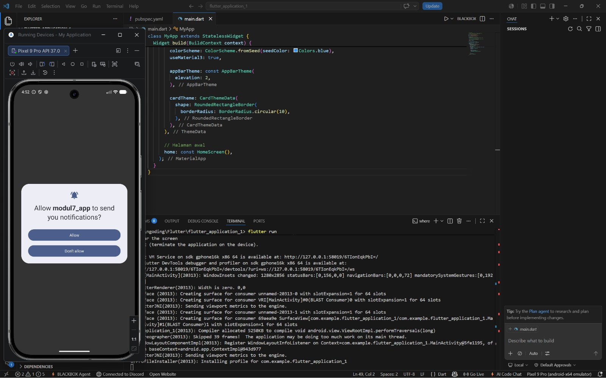
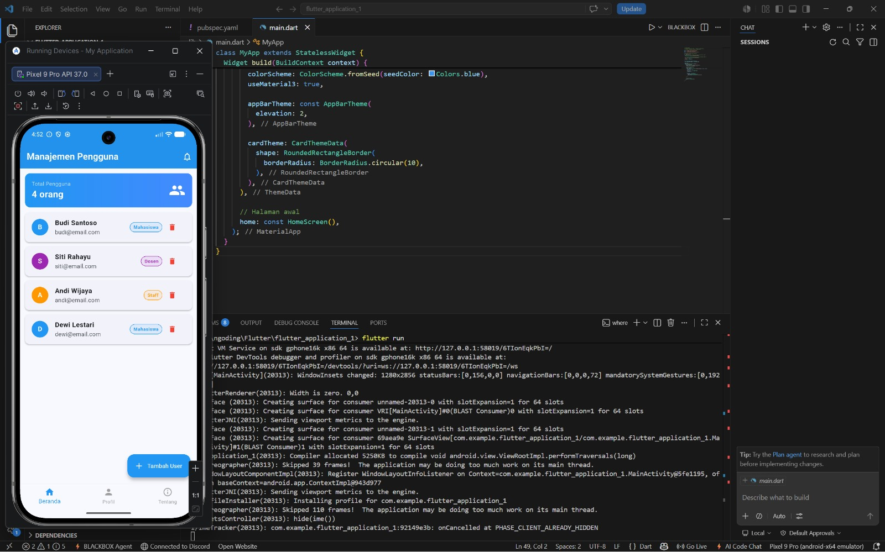
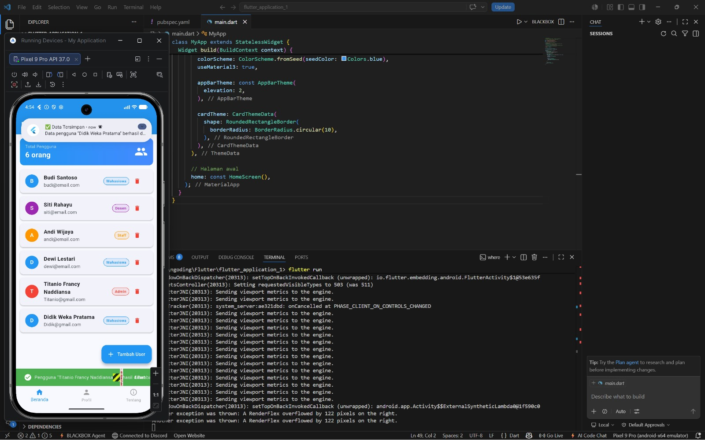
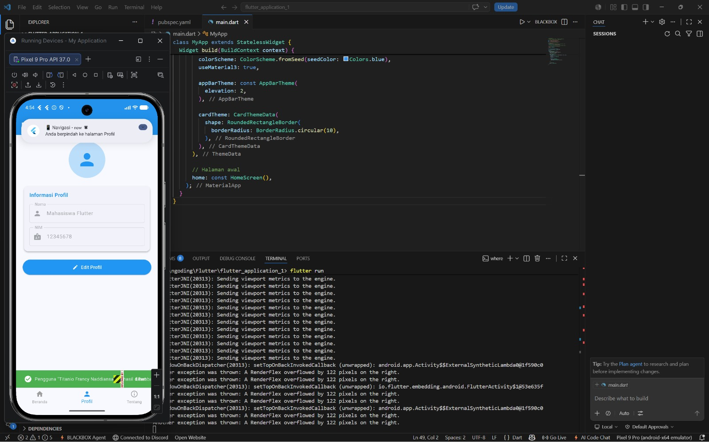
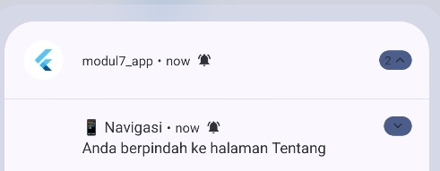

<div style="font-family: 'Times New Roman', Times, serif;">

<div align="center">
  <br />

  <h1>LAPORAN PRAKTIKUM <br>
  PEMROGRAMAN PERANGKAT BERGERAK
  </h1>

  <br />

  <h3>MODUL - 7<br>
    Praktikum Flutter — Navigasi & Notifikasi (Unguided)
  </h3>

  <br />

  

  <br />
  <br />
  <br />

  <h3>Disusun Oleh :</h3>

  <p>
    <strong>Didik Weka Pratama</strong><br>
    <strong>2311102285</strong><br>
    <strong>S1 IF-11-04</strong>
  </p>

  <br />

  <h3>Dosen Pengampu :</h3>

  <p>
    <strong>Cahyo Prihantoro, S.Kom., M.Eng.</strong>
  </p>

  <br />

  <h3>LABORATORIUM HIGH PERFORMANCE
  <br>FAKULTAS INFORMATIKA <br>UNIVERSITAS TELKOM PURWOKERTO <br>2026</h3>
</div>

<hr>

## 1. Penjelasan Singkat

Pada tugas **Unguided Modul 7** ini, praktikum berfokus pada penerapan **navigasi antar halaman** dan **notifikasi** dalam satu aplikasi Flutter bernama `modul7_app`. Aplikasi ini merupakan sistem manajemen pengguna sederhana yang menggabungkan materi dari **Modul 6** (Form, BottomNavigationBar, DropdownButton) dan **Modul 7** (Model Class, Navigation, Local Notifications).

Konsep utama yang diterapkan:

1. **Model Class** : Membuat class `User` dengan `factory constructor` dari JSON untuk merepresentasikan data pengguna secara terstruktur, sesuai materi Modul 7.1.

2. **Navigator.push() & Navigator.pop()** : Navigasi antar halaman dengan cara mengirimkan data objek `User` sebagai parameter ke halaman `DetailScreen`, sesuai materi Modul 7.2.

3. **BottomNavigationBar** : Menu navigasi bawah dengan 3 tab (Beranda, Profil, Tentang) menggunakan `setState` untuk mengatur halaman yang aktif, sesuai materi Modul 6.2.3.2.

4. **SnackBar** : Widget notifikasi ringan yang muncul di bagian bawah layar, digunakan untuk memberikan feedback perpindahan halaman, sukses simpan data, error validasi form, dan konfirmasi hapus data (lengkap dengan fitur Undo).

5. **flutter_local_notifications** : Package notifikasi sistem Android yang menampilkan notifikasi di status bar perangkat, digunakan saat data berhasil disimpan dan saat berpindah tab, sesuai materi Modul 7.3.

6. **AlertDialog** : Dialog konfirmasi modal yang muncul sebelum user menghapus data, memerlukan interaksi pengguna sebelum melanjutkan aksi.

7. **Form Validation** : Validasi input pada `TextFormField` dengan pesan error yang berbeda sesuai kondisi (field kosong, nama terlalu pendek, format email tidak valid).

---

## 2. Struktur Project

```
modul7_app/
├── lib/
│   ├── main.dart                        ← Entry point, inisialisasi notifikasi
│   ├── models/
│   │   └── user.dart                    ← Model Class User (Modul 7.1)
│   ├── services/
│   │   └── notification_service.dart    ← Service flutter_local_notifications (Modul 7.3)
│   └── screens/
│       ├── home_screen.dart             ← Halaman utama + BottomNavigationBar (Modul 6)
│       ├── detail_screen.dart           ← Halaman detail, menerima data User (Modul 7.2.2)
│       ├── add_user_screen.dart         ← Form tambah user + validasi (Modul 6.2.2)
│       ├── profile_screen.dart          ← Tab Profil
│       └── about_screen.dart           ← Tab Tentang
├── android/app/src/main/
│   └── AndroidManifest.xml             ← Permission notifikasi (Modul 7.3)
└── pubspec.yaml                         ← Dependencies
```

---

## 3. Langkah-langkah Praktikum

### Langkah 1 — Siapkan Project & Dependencies

Tambahkan package `flutter_local_notifications` pada `pubspec.yaml`:

```yaml
dependencies:
  flutter:
    sdk: flutter
  flutter_local_notifications: ^17.0.0
  permission_handler: ^11.0.0
```

Kemudian jalankan:
```bash
flutter pub get
```

---

### Langkah 2 — Tambahkan Permission di AndroidManifest.xml

Sesuai materi **Modul 7.3**, tambahkan permission berikut pada `android/app/src/main/AndroidManifest.xml`:

```xml
<!-- Permission untuk notifikasi (sesuai Modul 7) -->
<uses-permission android:name="android.permission.RECEIVE_BOOT_COMPLETED"/>
<uses-permission android:name="android.permission.VIBRATE" />
<!-- Untuk Android 13+ (API 33+) -->
<uses-permission android:name="android.permission.POST_NOTIFICATIONS"/>
```

---

### Langkah 3 — Buat Model Class (`user.dart`)

Sesuai materi **Modul 7.1**, buat model class `User` dengan `factory constructor` dari JSON:

```dart
class User {
  final int id;
  final String name;
  final String email;
  final String role;

  const User({
    required this.id,
    required this.name,
    required this.email,
    required this.role,
  });

  // Factory constructor dari JSON (sesuai Modul 7)
  factory User.fromJson(Map<String, dynamic> json) {
    return User(
      id: json['id'],
      name: json['name'],
      email: json['email'],
      role: json['role'],
    );
  }
}
```

---

### Langkah 4 — Buat NotificationService (`notification_service.dart`)

Sesuai materi **Modul 7.3**, buat service untuk mengelola notifikasi. Kunci utama adalah membuat object `FlutterLocalNotificationsPlugin` dan melakukan inisialisasi di `initState`:

```dart
FlutterLocalNotificationsPlugin flutterLocalNotificationsPlugin =
    FlutterLocalNotificationsPlugin();

Future<void> initialize() async {
  const AndroidInitializationSettings initializationSettingsAndroid =
      AndroidInitializationSettings('@mipmap/ic_launcher');

  const InitializationSettings initializationSettings =
      InitializationSettings(android: initializationSettingsAndroid);

  await flutterLocalNotificationsPlugin.initialize(initializationSettings);
}
```

Fungsi untuk menampilkan notifikasi (sesuai `showNotification()` Modul 7):

```dart
Future<void> showNotification({
  required String title,
  required String body,
}) async {
  const AndroidNotificationDetails androidDetails = AndroidNotificationDetails(
    'modul7_channel', 'Modul 7 Notifications',
    importance: Importance.max,
    priority: Priority.high,
  );

  await flutterLocalNotificationsPlugin.show(
    0, title, body,
    const NotificationDetails(android: androidDetails),
  );
}
```

---

### Langkah 5 — Buat HomeScreen dengan BottomNavigationBar

Sesuai materi **Modul 6.2.3.2**, HomeScreen menggunakan `BottomNavigationBar` dengan 3 tab. Navigasi ke `DetailScreen` menggunakan `Navigator.push()` sesuai **Modul 7.2**:

```dart
// Navigasi ke halaman Detail dengan kirim data User (Modul 7.2.2)
void _navigateToDetail(User user) {
  Navigator.push(
    context,
    MaterialPageRoute(
      builder: (context) => DetailScreen(user: user), // kirim data
    ),
  );
}

// Handler BottomNavigationBar (Modul 6)
void _onItemTapped(int index) {
  setState(() {
    _selectedIndex = index;
  });
}
```

---

### Langkah 6 — Buat DetailScreen (Navigation + Kirim Data)

Sesuai materi **Modul 7.2.2**, `DetailScreen` menerima parameter `User` dari halaman sebelumnya. Tombol kembali menggunakan `Navigator.pop()`:

```dart
class DetailScreen extends StatelessWidget {
  // Menerima data dari halaman sebelumnya (sesuai Modul 7)
  final User user;

  const DetailScreen({Key? key, required this.user}) : super(key: key);

  @override
  Widget build(BuildContext context) {
    return Scaffold(
      appBar: AppBar(title: Text('Detail: ${user.name}')),
      body: /* tampilkan data user */,
      // Tombol kembali: Navigator.pop() sesuai Modul 7
      floatingActionButton: ElevatedButton(
        onPressed: () => Navigator.pop(context),
        child: const Text('Kembali'),
      ),
    );
  }
}
```

---

### Langkah 7 — Buat Form Tambah User dengan Validasi & Notifikasi

Sesuai materi **Modul 6.2.2**, form menggunakan `TextFormField` dengan validasi. Notifikasi ditampilkan sesuai kondisi:

```dart
void _submitForm() async {
  if (_formKey.currentState!.validate()) {
    //  SnackBar sukses
    ScaffoldMessenger.of(context).showSnackBar(
      SnackBar(
        content: Text('Pengguna berhasil ditambahkan!'),
        backgroundColor: Colors.green,
      ),
    );
    //  Local Notification sistem
    await _notificationService.showSuccessNotification(newUser.name);
  } else {
    // SnackBar error validasi
    ScaffoldMessenger.of(context).showSnackBar(
      const SnackBar(
        content: Text('Mohon lengkapi semua data dengan benar!'),
        backgroundColor: Colors.red,
      ),
    );
  }
}
```

---

## 4. Source Code Lengkap

### 4.1 `lib/main.dart`

```dart
import 'package:flutter/material.dart';
import 'screens/home_screen.dart';
import 'services/notification_service.dart';

void main() async {
  WidgetsFlutterBinding.ensureInitialized();
  // Inisialisasi NotificationService (sesuai Modul 7)
  await NotificationService().initialize();
  runApp(const MyApp());
}

class MyApp extends StatelessWidget {
  const MyApp({Key? key}) : super(key: key);

  @override
  Widget build(BuildContext context) {
    return MaterialApp(
      title: 'Modul 7 - Navigasi & Notifikasi',
      debugShowCheckedModeBanner: false,
      theme: ThemeData(
        colorScheme: ColorScheme.fromSeed(seedColor: Colors.blue),
        useMaterial3: true,
        appBarTheme: const AppBarTheme(elevation: 2),
        cardTheme: CardTheme(
          shape: RoundedRectangleBorder(
            borderRadius: BorderRadius.circular(10),
          ),
        ),
      ),
      home: const HomeScreen(),
    );
  }
}
```

---

### 4.2 `lib/models/user.dart`

```dart
class User {
  final int id;
  final String name;
  final String email;
  final String role;

  const User({
    required this.id,
    required this.name,
    required this.email,
    required this.role,
  });

  factory User.fromJson(Map<String, dynamic> json) {
    return User(
      id: json['id'],
      name: json['name'],
      email: json['email'],
      role: json['role'],
    );
  }

  Map<String, dynamic> toJson() {
    return {'id': id, 'name': name, 'email': email, 'role': role};
  }
}
```

---

### 4.3 `lib/services/notification_service.dart`

```dart
import 'package:flutter/material.dart';
import 'package:flutter_local_notifications/flutter_local_notifications.dart';

class NotificationService {
  static final NotificationService _instance = NotificationService._internal();
  factory NotificationService() => _instance;
  NotificationService._internal();

  // Object FlutterLocalNotificationsPlugin (sesuai Modul 7)
  final FlutterLocalNotificationsPlugin flutterLocalNotificationsPlugin =
      FlutterLocalNotificationsPlugin();

  Future<void> initialize() async {
    const AndroidInitializationSettings initializationSettingsAndroid =
        AndroidInitializationSettings('@mipmap/ic_launcher');

    const DarwinInitializationSettings initializationSettingsIOS =
        DarwinInitializationSettings(
      requestAlertPermission: true,
      requestBadgePermission: true,
      requestSoundPermission: true,
    );

    const InitializationSettings initializationSettings = InitializationSettings(
      android: initializationSettingsAndroid,
      iOS: initializationSettingsIOS,
    );

    await flutterLocalNotificationsPlugin.initialize(
      initializationSettings,
      onDidReceiveNotificationResponse: onSelectNotification,
    );

    await flutterLocalNotificationsPlugin
        .resolvePlatformSpecificImplementation<
            AndroidFlutterLocalNotificationsPlugin>()
        ?.requestNotificationsPermission();
  }

  // Handler saat notifikasi dipilih (sesuai Modul 7)
  void onSelectNotification(NotificationResponse response) {
    debugPrint('Notifikasi dipilih: ${response.payload}');
  }

  // Fungsi utama tampilkan notifikasi (sesuai showNotification() Modul 7)
  Future<void> showNotification({
    int id = 0,
    required String title,
    required String body,
    String? payload,
  }) async {
    const AndroidNotificationDetails androidDetails = AndroidNotificationDetails(
      'modul7_channel',
      'Modul 7 Notifications',
      channelDescription: 'Notifikasi untuk aplikasi Modul 7',
      importance: Importance.max,
      priority: Priority.high,
    );

    const NotificationDetails notificationDetails =
        NotificationDetails(android: androidDetails);

    await flutterLocalNotificationsPlugin.show(
        id, title, body, notificationDetails, payload: payload);
  }

  Future<void> showNavigationNotification(String pageName) async {
    await showNotification(
      id: 1,
      title: '📱 Navigasi',
      body: 'Anda berpindah ke halaman $pageName',
    );
  }

  Future<void> showSuccessNotification(String userName) async {
    await showNotification(
      id: 2,
      title: 'Data Tersimpan',
      body: 'Data pengguna "$userName" berhasil ditambahkan!',
    );
  }

  Future<void> showErrorNotification(String message) async {
    await showNotification(
      id: 3,
      title: 'Terjadi Kesalahan',
      body: message,
    );
  }
}
```

---

### 4.4 `lib/screens/home_screen.dart`

```dart
import 'package:flutter/material.dart';
import '../models/user.dart';
import '../services/notification_service.dart';
import 'detail_screen.dart';
import 'add_user_screen.dart';
import 'profile_screen.dart';
import 'about_screen.dart';

class HomeScreen extends StatefulWidget {
  const HomeScreen({Key? key}) : super(key: key);

  @override
  State<HomeScreen> createState() => _HomeScreenState();
}

class _HomeScreenState extends State<HomeScreen> {
  int _selectedIndex = 0;
  final NotificationService _notificationService = NotificationService();

  List<User> _users = [
    const User(id: 1, name: 'Budi Santoso', email: 'budi@email.com', role: 'Mahasiswa'),
    const User(id: 2, name: 'Siti Rahayu', email: 'siti@email.com', role: 'Dosen'),
    const User(id: 3, name: 'Andi Wijaya', email: 'andi@email.com', role: 'Staff'),
    const User(id: 4, name: 'Dewi Lestari', email: 'dewi@email.com', role: 'Mahasiswa'),
  ];

  // Handler BottomNavigationBar (Modul 6)
  void _onItemTapped(int index) async {
    final tabNames = ['Beranda', 'Profil', 'Tentang'];
    if (index != _selectedIndex) {
      // SnackBar saat pindah tab
      ScaffoldMessenger.of(context).showSnackBar(
        SnackBar(
          content: Text('Berpindah ke tab ${tabNames[index]}'),
          backgroundColor: Colors.blueGrey,
          duration: const Duration(seconds: 1),
          behavior: SnackBarBehavior.floating,
        ),
      );
      // Local notification saat pindah tab
      await _notificationService.showNavigationNotification(tabNames[index]);
    }
    setState(() => _selectedIndex = index);
  }

  // Navigator.push dengan kirim data User (Modul 7.2.2)
  void _navigateToDetail(User user) {
    Navigator.push(
      context,
      MaterialPageRoute(builder: (context) => DetailScreen(user: user)),
    );
  }

  // Navigator.push ke halaman tambah user (Modul 7.2)
  void _navigateToAddUser() {
    Navigator.push(
      context,
      MaterialPageRoute(
        builder: (context) => AddUserScreen(onUserAdded: _addUser),
      ),
    );
  }

  void _addUser(User user) => setState(() => _users.add(user));

  void _deleteUser(User user) async {
    final confirmed = await showDialog<bool>(
      context: context,
      builder: (context) => AlertDialog(
        title: const Text('Hapus Pengguna'),
        content: Text('Yakin ingin menghapus "${user.name}"?'),
        actions: [
          TextButton(onPressed: () => Navigator.pop(context, false), child: const Text('Batal')),
          ElevatedButton(
            onPressed: () => Navigator.pop(context, true),
            style: ElevatedButton.styleFrom(backgroundColor: Colors.red),
            child: const Text('Hapus', style: TextStyle(color: Colors.white)),
          ),
        ],
      ),
    );

    if (confirmed == true) {
      setState(() => _users.removeWhere((u) => u.id == user.id));
      if (mounted) {
        ScaffoldMessenger.of(context).showSnackBar(
          SnackBar(
            content: Text('Pengguna "${user.name}" berhasil dihapus'),
            backgroundColor: Colors.orange,
            action: SnackBarAction(
              label: 'Undo',
              textColor: Colors.white,
              onPressed: () => setState(() => _users.add(user)),
            ),
          ),
        );
      }
    }
  }

  @override
  Widget build(BuildContext context) {
    return Scaffold(
      appBar: AppBar(
        title: const Text('Manajemen Pengguna',
            style: TextStyle(fontWeight: FontWeight.bold)),
        backgroundColor: Colors.blue,
        foregroundColor: Colors.white,
      ),
      body: _selectedIndex == 0
          ? _buildHomeTab()
          : _selectedIndex == 1
              ? const ProfileScreen()
              : const AboutScreen(),
      floatingActionButton: _selectedIndex == 0
          ? FloatingActionButton.extended(
              onPressed: _navigateToAddUser,
              backgroundColor: Colors.blue,
              foregroundColor: Colors.white,
              icon: const Icon(Icons.add),
              label: const Text('Tambah User'),
            )
          : null,
      // BottomNavigationBar sesuai Modul 6
      bottomNavigationBar: BottomNavigationBar(
        currentIndex: _selectedIndex,
        selectedItemColor: Colors.blue,
        onTap: _onItemTapped,
        items: const [
          BottomNavigationBarItem(icon: Icon(Icons.home), label: 'Beranda'),
          BottomNavigationBarItem(icon: Icon(Icons.person), label: 'Profil'),
          BottomNavigationBarItem(icon: Icon(Icons.info_outline), label: 'Tentang'),
        ],
      ),
    );
  }

  Widget _buildHomeTab() {
    return Column(
      children: [
        Container(
          padding: const EdgeInsets.all(16),
          margin: const EdgeInsets.all(12),
          decoration: BoxDecoration(
            gradient: const LinearGradient(colors: [Colors.blue, Colors.blueAccent]),
            borderRadius: BorderRadius.circular(12),
          ),
          child: Row(
            mainAxisAlignment: MainAxisAlignment.spaceBetween,
            children: [
              Column(crossAxisAlignment: CrossAxisAlignment.start, children: [
                const Text('Total Pengguna', style: TextStyle(color: Colors.white70)),
                Text('${_users.length} orang',
                    style: const TextStyle(color: Colors.white, fontSize: 22,
                        fontWeight: FontWeight.bold)),
              ]),
              const Icon(Icons.people, color: Colors.white, size: 40),
            ],
          ),
        ),
        Expanded(
          child: ListView.builder(
            itemCount: _users.length,
            itemBuilder: (context, index) {
              final user = _users[index];
              return Card(
                margin: const EdgeInsets.symmetric(horizontal: 12, vertical: 5),
                child: ListTile(
                  leading: CircleAvatar(
                    backgroundColor: Colors.blue,
                    child: Text(user.name[0].toUpperCase(),
                        style: const TextStyle(color: Colors.white)),
                  ),
                  title: Text(user.name, style: const TextStyle(fontWeight: FontWeight.bold)),
                  subtitle: Text(user.email),
                  trailing: Row(mainAxisSize: MainAxisSize.min, children: [
                    Chip(label: Text(user.role, style: const TextStyle(fontSize: 11))),
                    IconButton(
                      icon: const Icon(Icons.delete, color: Colors.red, size: 20),
                      onPressed: () => _deleteUser(user),
                    ),
                  ]),
                  onTap: () => _navigateToDetail(user), // Navigator.push Modul 7
                ),
              );
            },
          ),
        ),
      ],
    );
  }
}
```

---

### 4.5 `lib/screens/detail_screen.dart`

```dart
import 'package:flutter/material.dart';
import '../models/user.dart';

class DetailScreen extends StatelessWidget {
  // Menerima parameter data User (sesuai Modul 7.2.2)
  final User user;

  const DetailScreen({Key? key, required this.user}) : super(key: key);

  @override
  Widget build(BuildContext context) {
    return Scaffold(
      appBar: AppBar(
        title: Text('Detail: ${user.name}'),
        backgroundColor: Colors.blue,
        foregroundColor: Colors.white,
      ),
      body: Padding(
        padding: const EdgeInsets.all(20.0),
        child: Column(
          children: [
            CircleAvatar(
              radius: 50,
              backgroundColor: Colors.blue,
              child: Text(user.name[0].toUpperCase(),
                  style: const TextStyle(fontSize: 40, color: Colors.white)),
            ),
            const SizedBox(height: 24),
            Card(
              elevation: 4,
              child: Padding(
                padding: const EdgeInsets.all(16.0),
                child: Column(children: [
                  _buildRow(Icons.badge, 'ID', '#${user.id}'),
                  const Divider(),
                  _buildRow(Icons.person, 'Nama', user.name),
                  const Divider(),
                  _buildRow(Icons.email, 'Email', user.email),
                  const Divider(),
                  _buildRow(Icons.work, 'Role', user.role),
                ]),
              ),
            ),
            const SizedBox(height: 30),
            SizedBox(
              width: double.infinity,
              child: ElevatedButton.icon(
                // Navigator.pop() sesuai Modul 7
                onPressed: () => Navigator.pop(context),
                icon: const Icon(Icons.arrow_back),
                label: const Text('Kembali'),
                style: ElevatedButton.styleFrom(
                  backgroundColor: Colors.blue,
                  foregroundColor: Colors.white,
                  padding: const EdgeInsets.symmetric(vertical: 14),
                ),
              ),
            ),
          ],
        ),
      ),
    );
  }

  Widget _buildRow(IconData icon, String label, String value) {
    return Padding(
      padding: const EdgeInsets.symmetric(vertical: 8),
      child: Row(children: [
        Icon(icon, color: Colors.blue),
        const SizedBox(width: 12),
        Text('$label:', style: const TextStyle(fontWeight: FontWeight.bold, color: Colors.grey)),
        const SizedBox(width: 8),
        Expanded(child: Text(value)),
      ]),
    );
  }
}
```

---

### 4.6 `lib/screens/add_user_screen.dart`

```dart
import 'package:flutter/material.dart';
import '../models/user.dart';
import '../services/notification_service.dart';

class AddUserScreen extends StatefulWidget {
  final Function(User) onUserAdded;
  const AddUserScreen({Key? key, required this.onUserAdded}) : super(key: key);

  @override
  State<AddUserScreen> createState() => _AddUserScreenState();
}

class _AddUserScreenState extends State<AddUserScreen> {
  final _formKey = GlobalKey<FormState>();
  final _nameController = TextEditingController();
  final _emailController = TextEditingController();
  // Dropdown sesuai Modul 6 DropdownButton
  String _selectedRole = 'Mahasiswa';
  final List<String> _roles = ['Mahasiswa', 'Dosen', 'Staff', 'Admin'];
  final NotificationService _notifService = NotificationService();

  void _submitForm() async {
    if (_formKey.currentState!.validate()) {
      final newUser = User(
        id: DateTime.now().millisecondsSinceEpoch % 10000,
        name: _nameController.text.trim(),
        email: _emailController.text.trim(),
        role: _selectedRole,
      );
      widget.onUserAdded(newUser);

      // SnackBar sukses
      ScaffoldMessenger.of(context).showSnackBar(
        SnackBar(
          content: Text('Pengguna "${newUser.name}" berhasil ditambahkan!'),
          backgroundColor: Colors.green,
          action: SnackBarAction(label: 'Lihat', textColor: Colors.white,
              onPressed: () => Navigator.pop(context)),
        ),
      );
      // Local Notification sukses
      await _notifService.showSuccessNotification(newUser.name);
      if (mounted) Navigator.pop(context);
    } else {
      // SnackBar error validasi
      ScaffoldMessenger.of(context).showSnackBar(
        const SnackBar(
          content: Text('Mohon lengkapi semua data dengan benar!'),
          backgroundColor: Colors.red,
        ),
      );
      // Local Notification error
      await _notifService.showErrorNotification(
          'Form tidak valid, mohon periksa kembali input Anda.');
    }
  }

  @override
  Widget build(BuildContext context) {
    return Scaffold(
      appBar: AppBar(title: const Text('Tambah Pengguna'),
          backgroundColor: Colors.blue, foregroundColor: Colors.white),
      body: Padding(
        padding: const EdgeInsets.all(16),
        child: Form(
          key: _formKey,
          child: Column(children: [
            // TextFormField Nama (Modul 6)
            TextFormField(
              controller: _nameController,
              decoration: const InputDecoration(
                border: OutlineInputBorder(), labelText: 'Nama Lengkap',
                prefixIcon: Icon(Icons.person)),
              validator: (v) {
                if (v == null || v.trim().isEmpty) return 'Nama tidak boleh kosong';
                if (v.trim().length < 3) return 'Nama minimal 3 karakter';
                return null;
              },
            ),
            const SizedBox(height: 16),
            // TextFormField Email (Modul 6)
            TextFormField(
              controller: _emailController,
              keyboardType: TextInputType.emailAddress,
              decoration: const InputDecoration(
                border: OutlineInputBorder(), labelText: 'Email',
                prefixIcon: Icon(Icons.email)),
              validator: (v) {
                if (v == null || v.trim().isEmpty) return 'Email tidak boleh kosong';
                if (!RegExp(r'^[^@]+@[^@]+\.[^@]+').hasMatch(v.trim()))
                  return 'Format email tidak valid';
                return null;
              },
            ),
            const SizedBox(height: 16),
            // DropdownButton Role (Modul 6)
            DropdownButtonFormField<String>(
              value: _selectedRole,
              decoration: const InputDecoration(
                border: OutlineInputBorder(), labelText: 'Role',
                prefixIcon: Icon(Icons.work)),
              items: _roles.map((r) =>
                  DropdownMenuItem(value: r, child: Text(r))).toList(),
              onChanged: (v) => setState(() => _selectedRole = v!),
            ),
            const SizedBox(height: 30),
            // ElevatedButton simpan (Modul 6)
            SizedBox(
              width: double.infinity,
              child: ElevatedButton.icon(
                onPressed: _submitForm,
                icon: const Icon(Icons.save),
                label: const Text('Simpan Data'),
                style: ElevatedButton.styleFrom(
                  backgroundColor: Colors.blue, foregroundColor: Colors.white,
                  padding: const EdgeInsets.symmetric(vertical: 14)),
              ),
            ),
          ]),
        ),
      ),
    );
  }
}
```

---

## 5. Ringkasan Notifikasi

| No | Halaman | Jenis Notifikasi | Trigger |
|:---:|:---|:---:|:---|
| 1 | HomeScreen | SnackBar (abu) | Saat berpindah tab BottomNavigationBar |
| 2 | HomeScreen | Local Notification | Saat berpindah tab (muncul di status bar) |
| 3 | HomeScreen | AlertDialog | Konfirmasi sebelum menghapus data pengguna |
| 4 | HomeScreen | SnackBar + Undo (oranye) | Pengguna berhasil dihapus, bisa di-undo |
| 5 | AddUserScreen | SnackBar (hijau) | Form valid, data pengguna berhasil disimpan |
| 6 | AddUserScreen | Local Notification | Data berhasil disimpan (muncul di status bar) |
| 7 | AddUserScreen | SnackBar (merah) | Validasi form gagal (field kosong / format salah) |
| 8 | AddUserScreen | Local Notification | Validasi form gagal |
| 9 | DetailScreen | SnackBar (abu) | Saat menekan tombol Kembali |
| 10 | ProfileScreen | SnackBar (hijau) | Profil berhasil diperbarui |
| 11 | ProfileScreen | Local Notification | Data profil berhasil disimpan |
| 12 | AppBar (bell icon) | SnackBar + Local Notification | Tombol test notifikasi di AppBar ditekan |

---

## 6. Cara Menjalankan

1. Pastikan Flutter SDK terinstall. Cek dengan:
   ```bash
   flutter doctor
   ```

2. Install dependencies:
   ```bash
   flutter pub get
   ```

3. Jalankan aplikasi di emulator atau perangkat fisik:
   ```bash
   flutter run
   ```

4. Saat pertama kali berjalan, izinkan permission notifikasi saat dialog muncul.

5. Eksplorasi fitur:
   - Tap item pengguna → navigasi ke halaman Detail
   - Tap **Tambah User** → isi form → coba submit kosong dan valid
   - Tap ikon 🗑️ → konfirmasi hapus → undo
   - Pindah tab Profil / Tentang → lihat notifikasi sistem

---

## 7. Screenshot Hasil Tampilan

<br>

<div align="center">

| No | Deskripsi | Screenshot |
|:---:|:---|:---:|
| 1 | Permission notifikasi muncul saat aplikasi pertama kali dijalankan |  |
| 2 | Halaman Beranda — daftar pengguna dengan BottomNavigationBar |  |
| 3 | Notifikasi sistem (local notification) muncul di status bar saat data berhasil disimpan |  |
| 4 | Halaman Profil — local notification "Navigasi" muncul di status bar saat pindah tab |  |
| 5 | Notifikasi sistem terstacking di notification tray Android |  |

</div>

<br>

---

## 8. Kesimpulan

Pada praktikum Unguided Modul 7 ini, berhasil diimplementasikan:

1. **Model Class** sesuai Modul 7.1 — class `User` dengan `factory constructor` dari JSON sebagai standar representasi data dalam aplikasi.

2. **Navigasi antar halaman** sesuai Modul 7.2 — menggunakan `Navigator.push()` untuk berpindah halaman dan `Navigator.pop()` untuk kembali, termasuk pengiriman data objek `User` ke `DetailScreen` melalui parameter constructor (Modul 7.2.2).

3. **flutter_local_notifications** sesuai Modul 7.3 — notifikasi sistem Android yang muncul di status bar, digunakan saat data berhasil disimpan dan saat berpindah tab, dilengkapi permission `POST_NOTIFICATIONS` di `AndroidManifest.xml`.

4. **BottomNavigationBar** sesuai Modul 6.2.3.2 — menu navigasi bawah dengan 3 tab menggunakan `setState` untuk mengelola halaman aktif.

5. **Form & Validasi** sesuai Modul 6.2.2 — `TextFormField` dengan validator yang menghasilkan pesan error berbeda sesuai kondisi (field kosong, nama terlalu pendek, format email salah).

6. **Sistem notifikasi yang beragam** — kombinasi `SnackBar` (feedback ringan, non-blocking), `AlertDialog` (konfirmasi penting yang memerlukan interaksi), dan `Local Notification` (notifikasi sistem di luar aplikasi) diterapkan sesuai kebutuhan masing-masing skenario.

</div>
