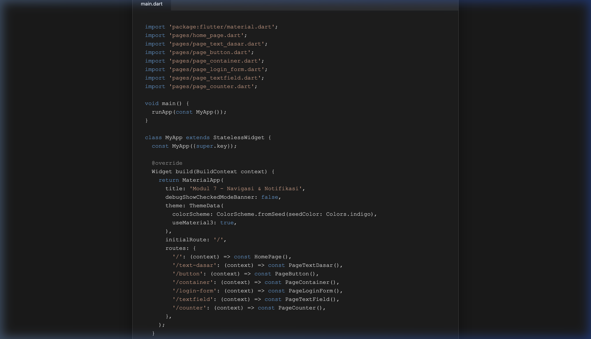
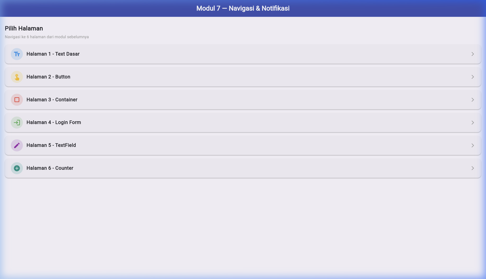
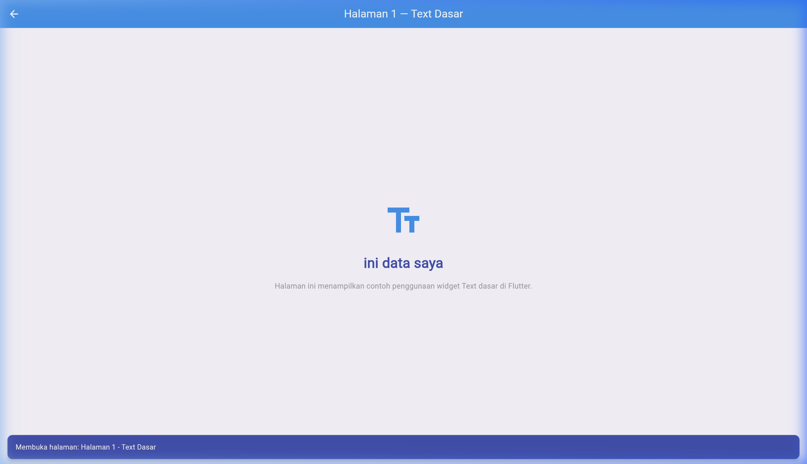
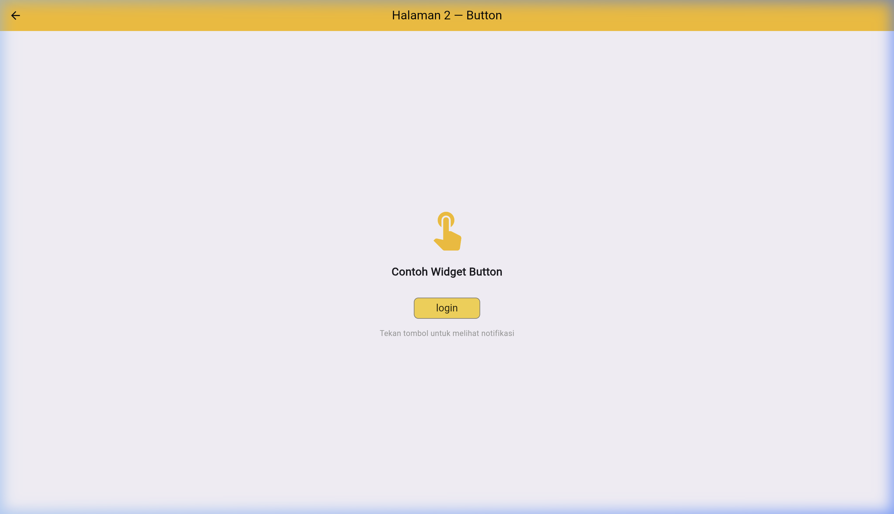
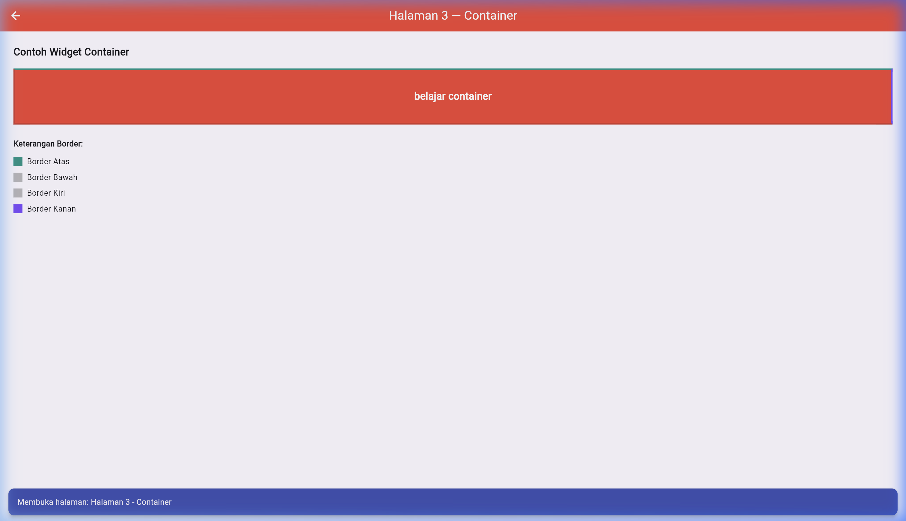
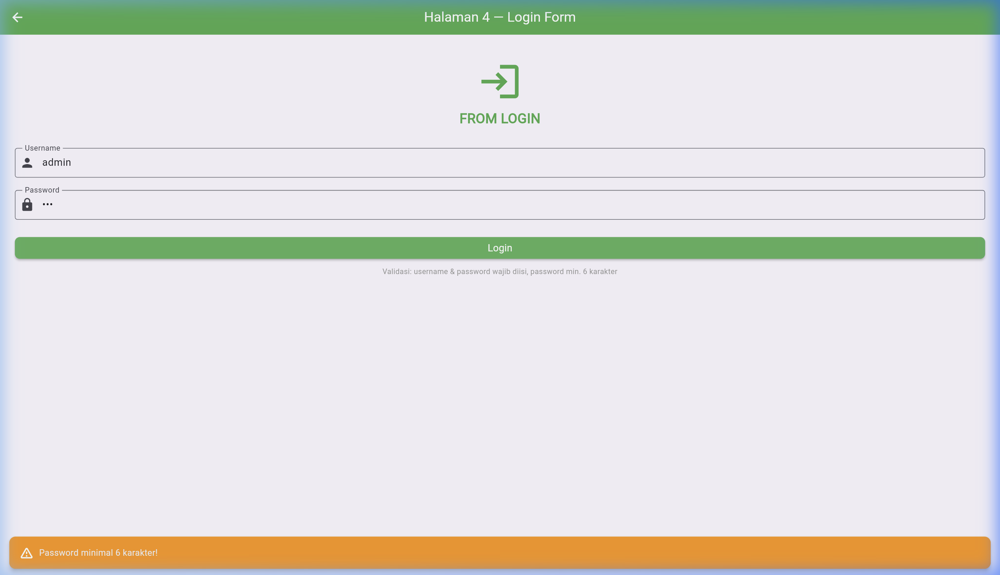
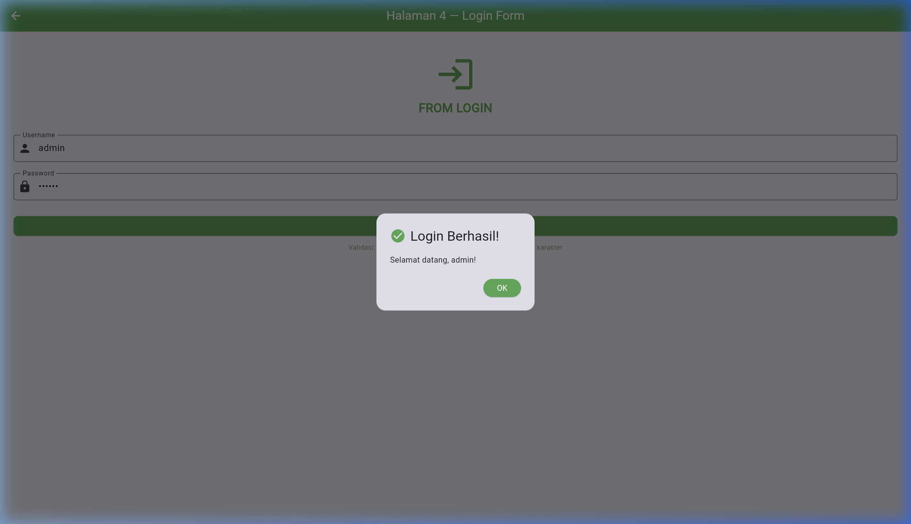
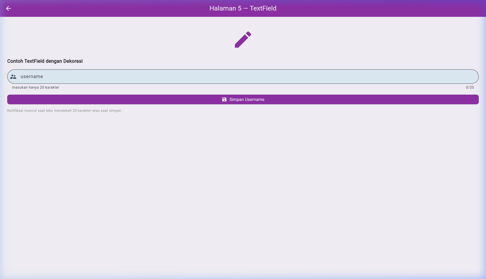
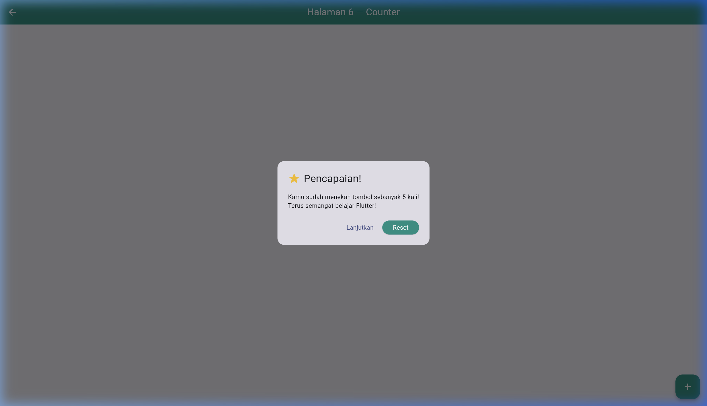
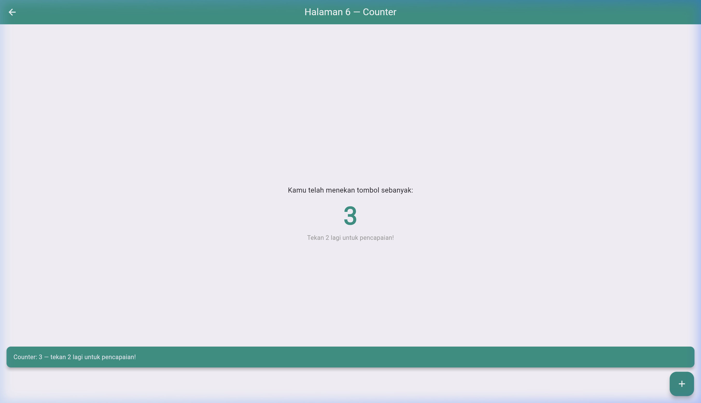

<div style="font-family: 'Times New Roman', Times, serif;">

<div align="center">
  <br />

  <h1>LAPORAN PRAKTIKUM <br>
  APLIKASI BERBASIS PLATFORM
  </h1>

  <br />

  <h3>MODUL - 7<br>
    Praktikum Flutter — Navigasi & Notifikasi (Unguided)
  </h3>

  <br />

  

  <br />
  <br />
  <br />

  <h3>Disusun Oleh :</h3>

  <p>
    <strong>Haposan Felix Marcel Siregar</strong><br>
    <strong>2311102210</strong><br>
    <strong>S1 IF-11-04</strong>
  </p>

  <br />

  <h3>Dosen Pengampu :</h3>

  <p>
    <strong>Cahyo Prihantoro, S.Kom., M.Eng.</strong>
  </p>

  <br />

  <h3>LABORATORIUM HIGH PERFORMANCE
  <br>FAKULTAS INFORMATIKA <br>UNIVERSITAS TELKOM PURWOKERTO <br>2026</h3>
</div>

<hr>

## 1. Penjelasan Singkat

Pada tugas **Unguided Modul 7** ini, praktikum berfokus pada penggabungan **6 source code** dari modul-modul sebelumnya ke dalam **satu aplikasi Flutter** yang dilengkapi dengan sistem **navigasi antar halaman** menggunakan `Navigator` dan **notifikasi** menggunakan `SnackBar` serta `AlertDialog`.

Konsep utama yang diterapkan:

1. **Named Routes** : Menggunakan `initialRoute` dan `routes` pada `MaterialApp` untuk mendefinisikan semua rute halaman secara terpusat, sehingga navigasi bisa dilakukan dari mana saja menggunakan `Navigator.pushNamed()`.

2. **Navigator.pushNamed()** : Navigasi ke halaman tertentu berdasarkan nama rute (string), sehingga tidak perlu mengimpor setiap file halaman di tempat pemanggilan.

3. **SnackBar** : Widget notifikasi ringan yang muncul di bagian bawah layar, digunakan untuk memberi feedback instan kepada pengguna (konfirmasi navigasi, peringatan input, dll).

4. **AlertDialog** : Widget notifikasi modal yang memerlukan interaksi pengguna sebelum melanjutkan, digunakan untuk konfirmasi penting seperti login berhasil atau pencapaian counter.

5. **StatefulWidget & Controller** : Pengelolaan state form menggunakan `TextEditingController` untuk membaca dan memvalidasi input pengguna.

6. **`addPostFrameCallback`** : Teknik untuk menjalankan kode setelah frame pertama selesai di-render, digunakan untuk menampilkan SnackBar saat halaman pertama kali dibuka.

---

## 2. Langkah-langkah Praktikum

### Langkah 1 — Siapkan Project Flutter

Gunakan project Flutter yang sudah ada (`testting`) sebagai base project. Project ini memiliki struktur standar Flutter.

```
testting/
├── lib/
│   └── main.dart
├── pubspec.yaml
└── ...
```

---

### Langkah 2 — Buat Folder `pages`

Di dalam folder `lib/`, buat subfolder bernama `pages` untuk menampung semua file halaman:

```
lib/
├── main.dart
└── pages/
    ├── home_page.dart
    ├── page_text_dasar.dart
    ├── page_button.dart
    ├── page_container.dart
    ├── page_login_form.dart
    ├── page_textfield.dart
    └── page_counter.dart
```

---

### Langkah 3 — Konfigurasi Named Routes di `main.dart`

Edit file `lib/main.dart` untuk mendefinisikan semua named routes:

<div align="center">
  
  <p><em>Gambar 1 — Konfigurasi Named Routes pada main.dart</em></p>
</div>

```dart
import 'package:flutter/material.dart';
import 'pages/home_page.dart';
import 'pages/page_text_dasar.dart';
import 'pages/page_button.dart';
import 'pages/page_container.dart';
import 'pages/page_login_form.dart';
import 'pages/page_textfield.dart';
import 'pages/page_counter.dart';

void main() {
  runApp(const MyApp());
}

class MyApp extends StatelessWidget {
  const MyApp({super.key});

  @override
  Widget build(BuildContext context) {
    return MaterialApp(
      title: 'Modul 7 - Navigasi & Notifikasi',
      debugShowCheckedModeBanner: false,
      theme: ThemeData(
        colorScheme: ColorScheme.fromSeed(seedColor: Colors.indigo),
        useMaterial3: true,
      ),
      initialRoute: '/',
      routes: {
        '/': (context) => const HomePage(),
        '/text-dasar': (context) => const PageTextDasar(),
        '/button': (context) => const PageButton(),
        '/container': (context) => const PageContainer(),
        '/login-form': (context) => const PageLoginForm(),
        '/textfield': (context) => const PageTextField(),
        '/counter': (context) => const PageCounter(),
      },
    );
  }
}
```

---

### Langkah 4 — Buat Halaman Home (`home_page.dart`)

Halaman utama menampilkan daftar menu navigasi ke 6 halaman. Setiap item menu menampilkan **SnackBar** saat ditekan sebagai notifikasi perpindahan halaman:

<div align="center">
  
  <p><em>Gambar 2 — Halaman Home dengan menu navigasi ke 6 halaman</em></p>
</div>

```dart
void _navigateTo(BuildContext context, String route, String label) {
  Navigator.pushNamed(context, route);
  ScaffoldMessenger.of(context).showSnackBar(
    SnackBar(
      content: Text('Membuka halaman: $label'),
      backgroundColor: Colors.indigo,
      duration: const Duration(seconds: 1),
      behavior: SnackBarBehavior.floating,
      shape: RoundedRectangleBorder(borderRadius: BorderRadius.circular(10)),
    ),
  );
}
```

---

### Langkah 5 — Buat Halaman 1: Text Dasar (`page_text_dasar.dart`)

Menampilkan teks sederhana dari modul `flutter1`. **SnackBar** ditampilkan otomatis saat halaman pertama kali dibuka menggunakan `addPostFrameCallback`:

<div align="center">
  
  <p><em>Gambar 3 — Halaman Text Dasar dengan SnackBar otomatis saat masuk</em></p>
</div>

```dart
@override
void initState() {
  super.initState();
  WidgetsBinding.instance.addPostFrameCallback((_) {
    ScaffoldMessenger.of(context).showSnackBar(
      SnackBar(
        content: Text('Selamat datang di Halaman Text Dasar!'),
        backgroundColor: Colors.blue,
        behavior: SnackBarBehavior.floating,
        duration: const Duration(seconds: 2),
      ),
    );
  });
}
```

---

### Langkah 6 — Buat Halaman 2: Button (`page_button.dart`)

Menampilkan tombol login dari modul `button`. Saat tombol ditekan, muncul **AlertDialog** sebagai notifikasi:

<div align="center">
  
  <p><em>Gambar 4 — Halaman Button dengan AlertDialog saat tombol ditekan</em></p>
</div>

```dart
void _showLoginNotification(BuildContext context) {
  showDialog(
    context: context,
    builder: (context) => AlertDialog(
      title: const Row(
        children: [
          Icon(Icons.check_circle, color: Colors.green),
          SizedBox(width: 8),
          Text('Tombol Ditekan!'),
        ],
      ),
      content: const Text('Tombol Login berhasil ditekan.\nFitur login belum tersedia.'),
      actions: [
        TextButton(
          onPressed: () => Navigator.pop(context),
          child: const Text('OK'),
        ),
      ],
    ),
  );
}
```

---

### Langkah 7 — Buat Halaman 3: Container (`page_container.dart`)

Menampilkan container dengan dekorasi border warna-warni dari modul `container`. **SnackBar** muncul otomatis saat halaman dibuka:

<div align="center">
  
  <p><em>Gambar 5 — Halaman Container dengan SnackBar otomatis dan keterangan border</em></p>
</div>

```dart
@override
void initState() {
  super.initState();
  WidgetsBinding.instance.addPostFrameCallback((_) {
    ScaffoldMessenger.of(context).showSnackBar(
      SnackBar(
        content: Text('Halaman Container — perhatikan dekorasi border!'),
        backgroundColor: Colors.red.shade700,
        behavior: SnackBarBehavior.floating,
        duration: const Duration(seconds: 2),
      ),
    );
  });
}
```

---

### Langkah 8 — Buat Halaman 4: Login Form (`page_login_form.dart`)

Menampilkan form login dari modul `rowdancollom`. Dilengkapi **validasi input** yang menampilkan SnackBar untuk error dan AlertDialog untuk sukses:

<div align="center">
  
  <p><em>Gambar 6 — SnackBar merah saat validasi gagal (field kosong)</em></p>
</div>

<div align="center">
  
  <p><em>Gambar 7 — AlertDialog hijau saat login berhasil</em></p>
</div>

```dart
void _handleLogin() {
  final username = _usernameCtrl.text.trim();
  final password = _passwordCtrl.text.trim();

  if (username.isEmpty && password.isEmpty) {
    _showSnackBar('Username dan password tidak boleh kosong!', Colors.red);
    return;
  }
  if (username.isEmpty) {
    _showSnackBar('Username tidak boleh kosong!', Colors.orange);
    return;
  }
  if (password.isEmpty) {
    _showSnackBar('Password tidak boleh kosong!', Colors.orange);
    return;
  }
  if (password.length < 6) {
    _showSnackBar('Password minimal 6 karakter!', Colors.orange);
    return;
  }
  // Semua validasi lolos — tampilkan AlertDialog sukses
  showDialog(
    context: context,
    builder: (context) => AlertDialog(
      title: const Text('Login Berhasil!'),
      content: Text('Selamat datang, $username!'),
      actions: [
        ElevatedButton(
          onPressed: () => Navigator.pop(context),
          child: const Text('OK'),
        ),
      ],
    ),
  );
}
```

---

### Langkah 9 — Buat Halaman 5: TextField (`page_textfield.dart`)

Menampilkan TextField berdekorasi dari modul `textfield`. Terdapat dua notifikasi:
- **SnackBar oranye** saat teks mencapai ≥18 karakter (mendekati limit 20)
- **SnackBar merah/ungu** saat tombol "Simpan Username" ditekan

<div align="center">
  
  <p><em>Gambar 8 — Halaman TextField dengan notifikasi mendekati batas karakter</em></p>
</div>

```dart
void _onTextChanged() {
  if (_ctrl.text.length >= 18 && !_limitWarningShown) {
    _limitWarningShown = true;
    ScaffoldMessenger.of(context).showSnackBar(
      SnackBar(
        content: Text('Mendekati batas! Maks. 20 karakter.'),
        backgroundColor: Colors.orange,
        behavior: SnackBarBehavior.floating,
        duration: const Duration(seconds: 2),
      ),
    );
  }
  if (_ctrl.text.length < 18) _limitWarningShown = false;
}
```

---

### Langkah 10 — Buat Halaman 6: Counter (`page_counter.dart`)

Menampilkan counter dari modul `testting`. Setiap penekanan tombol menampilkan SnackBar progress. Ketika counter mencapai **5**, muncul **AlertDialog pencapaian** dengan pilihan lanjutkan atau reset:

<div align="center">
  
  <p><em>Gambar 9 — AlertDialog pencapaian saat counter mencapai angka 5</em></p>
</div>

```dart
void _increment() {
  setState(() => _counter++);

  if (_counter == 5) {
    Future.delayed(const Duration(milliseconds: 100), () {
      showDialog(
        context: context,
        builder: (context) => AlertDialog(
          title: const Row(
            children: [
              Icon(Icons.star, color: Colors.amber),
              SizedBox(width: 8),
              Text('Pencapaian!'),
            ],
          ),
          content: const Text('Kamu sudah menekan tombol sebanyak 5 kali!'),
          actions: [
            TextButton(
              onPressed: () => Navigator.pop(context),
              child: const Text('Lanjutkan'),
            ),
            ElevatedButton(
              onPressed: () {
                setState(() => _counter = 0);
                Navigator.pop(context);
              },
              child: const Text('Reset'),
            ),
          ],
        ),
      );
    });
  } else {
    ScaffoldMessenger.of(context).showSnackBar(
      SnackBar(
        content: Text('Counter: $_counter — tekan ${5 - _counter} lagi untuk pencapaian!'),
        backgroundColor: Colors.teal,
        behavior: SnackBarBehavior.floating,
        duration: const Duration(milliseconds: 800),
      ),
    );
  }
}
```

---

## 3. Struktur Project

```
testting/
├── lib/
│   ├── main.dart                    # Entry point + konfigurasi Named Routes
│   └── pages/
│       ├── home_page.dart           # Halaman utama — menu navigasi 6 halaman
│       ├── page_text_dasar.dart     # Halaman 1 — Text Dasar (dari flutter1)
│       ├── page_button.dart         # Halaman 2 — Button (dari button)
│       ├── page_container.dart      # Halaman 3 — Container (dari container)
│       ├── page_login_form.dart     # Halaman 4 — Login Form (dari rowdancollom)
│       ├── page_textfield.dart      # Halaman 5 — TextField (dari textfield)
│       └── page_counter.dart        # Halaman 6 — Counter (dari testting)
├── pubspec.yaml
└── ...
```

---

## 4. Source Code Lengkap

### 4.1 `lib/main.dart`

```dart
import 'package:flutter/material.dart';
import 'pages/home_page.dart';
import 'pages/page_text_dasar.dart';
import 'pages/page_button.dart';
import 'pages/page_container.dart';
import 'pages/page_login_form.dart';
import 'pages/page_textfield.dart';
import 'pages/page_counter.dart';

void main() {
  runApp(const MyApp());
}

class MyApp extends StatelessWidget {
  const MyApp({super.key});

  @override
  Widget build(BuildContext context) {
    return MaterialApp(
      title: 'Modul 7 - Navigasi & Notifikasi',
      debugShowCheckedModeBanner: false,
      theme: ThemeData(
        colorScheme: ColorScheme.fromSeed(seedColor: Colors.indigo),
        useMaterial3: true,
      ),
      initialRoute: '/',
      routes: {
        '/': (context) => const HomePage(),
        '/text-dasar': (context) => const PageTextDasar(),
        '/button': (context) => const PageButton(),
        '/container': (context) => const PageContainer(),
        '/login-form': (context) => const PageLoginForm(),
        '/textfield': (context) => const PageTextField(),
        '/counter': (context) => const PageCounter(),
      },
    );
  }
}
```

---

### 4.2 `lib/pages/home_page.dart`

```dart
import 'package:flutter/material.dart';

class HomePage extends StatelessWidget {
  const HomePage({super.key});

  void _navigateTo(BuildContext context, String route, String label) {
    Navigator.pushNamed(context, route);
    ScaffoldMessenger.of(context).showSnackBar(
      SnackBar(
        content: Text('Membuka halaman: $label'),
        backgroundColor: Colors.indigo,
        duration: const Duration(seconds: 1),
        behavior: SnackBarBehavior.floating,
        shape: RoundedRectangleBorder(borderRadius: BorderRadius.circular(10)),
      ),
    );
  }

  @override
  Widget build(BuildContext context) {
    final List<Map<String, dynamic>> menus = [
      {'label': 'Halaman 1 - Text Dasar', 'route': '/text-dasar', 'icon': Icons.text_fields, 'color': Colors.blue},
      {'label': 'Halaman 2 - Button', 'route': '/button', 'icon': Icons.touch_app, 'color': Colors.amber},
      {'label': 'Halaman 3 - Container', 'route': '/container', 'icon': Icons.crop_square, 'color': Colors.red},
      {'label': 'Halaman 4 - Login Form', 'route': '/login-form', 'icon': Icons.login, 'color': Colors.green},
      {'label': 'Halaman 5 - TextField', 'route': '/textfield', 'icon': Icons.edit, 'color': Colors.purple},
      {'label': 'Halaman 6 - Counter', 'route': '/counter', 'icon': Icons.add_circle, 'color': Colors.teal},
    ];

    return Scaffold(
      appBar: AppBar(
        title: const Text(
          'Modul 7 — Navigasi & Notifikasi',
          style: TextStyle(fontWeight: FontWeight.bold),
        ),
        backgroundColor: Colors.indigo,
        foregroundColor: Colors.white,
        centerTitle: true,
      ),
      body: Padding(
        padding: const EdgeInsets.all(16),
        child: Column(
          crossAxisAlignment: CrossAxisAlignment.start,
          children: [
            const SizedBox(height: 8),
            const Text('Pilih Halaman', style: TextStyle(fontSize: 20, fontWeight: FontWeight.bold)),
            const SizedBox(height: 4),
            const Text('Navigasi ke 6 halaman dari modul sebelumnya', style: TextStyle(fontSize: 13, color: Colors.grey)),
            const SizedBox(height: 16),
            Expanded(
              child: ListView.builder(
                itemCount: menus.length,
                itemBuilder: (context, index) {
                  final menu = menus[index];
                  return Card(
                    margin: const EdgeInsets.only(bottom: 12),
                    elevation: 2,
                    shape: RoundedRectangleBorder(borderRadius: BorderRadius.circular(12)),
                    child: ListTile(
                      contentPadding: const EdgeInsets.symmetric(horizontal: 20, vertical: 8),
                      leading: CircleAvatar(
                        backgroundColor: (menu['color'] as Color).withOpacity(0.15),
                        child: Icon(menu['icon'] as IconData, color: menu['color'] as Color),
                      ),
                      title: Text(menu['label'] as String, style: const TextStyle(fontWeight: FontWeight.w600)),
                      trailing: const Icon(Icons.arrow_forward_ios, size: 16, color: Colors.grey),
                      onTap: () => _navigateTo(context, menu['route'] as String, menu['label'] as String),
                    ),
                  );
                },
              ),
            ),
          ],
        ),
      ),
    );
  }
}
```

---

### 4.3 `lib/pages/page_text_dasar.dart`

```dart
import 'package:flutter/material.dart';

class PageTextDasar extends StatefulWidget {
  const PageTextDasar({super.key});

  @override
  State<PageTextDasar> createState() => _PageTextDasarState();
}

class _PageTextDasarState extends State<PageTextDasar> {
  @override
  void initState() {
    super.initState();
    WidgetsBinding.instance.addPostFrameCallback((_) {
      ScaffoldMessenger.of(context).showSnackBar(
        SnackBar(
          content: const Row(
            children: [
              Icon(Icons.info_outline, color: Colors.white),
              SizedBox(width: 8),
              Text('Selamat datang di Halaman Text Dasar!'),
            ],
          ),
          backgroundColor: Colors.blue,
          behavior: SnackBarBehavior.floating,
          shape: RoundedRectangleBorder(borderRadius: BorderRadius.circular(10)),
          duration: const Duration(seconds: 2),
        ),
      );
    });
  }

  @override
  Widget build(BuildContext context) {
    return Scaffold(
      appBar: AppBar(
        title: const Text('Halaman 1 — Text Dasar'),
        backgroundColor: Colors.blue,
        foregroundColor: Colors.white,
      ),
      body: const Center(
        child: Column(
          mainAxisAlignment: MainAxisAlignment.center,
          children: [
            Icon(Icons.text_fields, size: 80, color: Colors.blue),
            SizedBox(height: 24),
            Text(
              'ini data saya',
              style: TextStyle(fontSize: 28, fontWeight: FontWeight.bold, color: Colors.indigo),
            ),
          ],
        ),
      ),
    );
  }
}
```

---

### 4.4 `lib/pages/page_button.dart`

```dart
import 'package:flutter/material.dart';

class PageButton extends StatelessWidget {
  const PageButton({super.key});

  void _showLoginNotification(BuildContext context) {
    showDialog(
      context: context,
      builder: (context) => AlertDialog(
        shape: RoundedRectangleBorder(borderRadius: BorderRadius.circular(16)),
        title: const Row(
          children: [
            Icon(Icons.check_circle, color: Colors.green),
            SizedBox(width: 8),
            Text('Tombol Ditekan!'),
          ],
        ),
        content: const Text('Tombol Login berhasil ditekan.\nFitur login belum tersedia.'),
        actions: [
          TextButton(
            onPressed: () => Navigator.pop(context),
            child: const Text('OK'),
          ),
        ],
      ),
    );
  }

  @override
  Widget build(BuildContext context) {
    return Scaffold(
      appBar: AppBar(
        title: const Text('Halaman 2 — Button'),
        backgroundColor: Colors.amber,
        foregroundColor: Colors.black,
      ),
      body: Center(
        child: OutlinedButton(
          onPressed: () => _showLoginNotification(context),
          style: OutlinedButton.styleFrom(
            backgroundColor: Colors.amberAccent,
            padding: const EdgeInsets.symmetric(horizontal: 40, vertical: 14),
          ),
          child: const Text('login', style: TextStyle(fontSize: 18, color: Colors.black87)),
        ),
      ),
    );
  }
}
```

---

### 4.5 `lib/pages/page_container.dart`

```dart
import 'package:flutter/material.dart';

class PageContainer extends StatefulWidget {
  const PageContainer({super.key});

  @override
  State<PageContainer> createState() => _PageContainerState();
}

class _PageContainerState extends State<PageContainer> {
  @override
  void initState() {
    super.initState();
    WidgetsBinding.instance.addPostFrameCallback((_) {
      ScaffoldMessenger.of(context).showSnackBar(
        SnackBar(
          content: const Row(
            children: [
              Icon(Icons.palette, color: Colors.white),
              SizedBox(width: 8),
              Text('Halaman Container — perhatikan dekorasi border!'),
            ],
          ),
          backgroundColor: Colors.red,
          behavior: SnackBarBehavior.floating,
          shape: RoundedRectangleBorder(borderRadius: BorderRadius.circular(10)),
          duration: const Duration(seconds: 2),
        ),
      );
    });
  }

  @override
  Widget build(BuildContext context) {
    return Scaffold(
      appBar: AppBar(
        title: const Text('Halaman 3 — Container'),
        backgroundColor: Colors.red,
        foregroundColor: Colors.white,
      ),
      body: Padding(
        padding: const EdgeInsets.all(24),
        child: Container(
          padding: const EdgeInsets.symmetric(vertical: 20, horizontal: 30),
          decoration: const BoxDecoration(
            color: Colors.red,
            border: Border(
              bottom: BorderSide(width: 3, color: Colors.black12),
              left: BorderSide(width: 3, color: Colors.black12),
              right: BorderSide(width: 3, color: Colors.deepPurpleAccent),
              top: BorderSide(width: 3, color: Colors.teal),
            ),
          ),
          width: double.infinity,
          height: 100,
          child: const Center(
            child: Text(
              'belajar container',
              style: TextStyle(color: Colors.white, fontSize: 18, fontWeight: FontWeight.bold),
            ),
          ),
        ),
      ),
    );
  }
}
```

---

### 4.6 `lib/pages/page_login_form.dart`

```dart
import 'package:flutter/material.dart';

class PageLoginForm extends StatefulWidget {
  const PageLoginForm({super.key});

  @override
  State<PageLoginForm> createState() => _PageLoginFormState();
}

class _PageLoginFormState extends State<PageLoginForm> {
  final TextEditingController _usernameCtrl = TextEditingController();
  final TextEditingController _passwordCtrl = TextEditingController();

  void _showSnackBar(String message, Color color) {
    ScaffoldMessenger.of(context).showSnackBar(
      SnackBar(
        content: Row(
          children: [
            const Icon(Icons.warning_amber_rounded, color: Colors.white),
            const SizedBox(width: 8),
            Expanded(child: Text(message)),
          ],
        ),
        backgroundColor: color,
        behavior: SnackBarBehavior.floating,
        shape: RoundedRectangleBorder(borderRadius: BorderRadius.circular(10)),
        duration: const Duration(seconds: 3),
      ),
    );
  }

  void _handleLogin() {
    final username = _usernameCtrl.text.trim();
    final password = _passwordCtrl.text.trim();

    if (username.isEmpty && password.isEmpty) {
      _showSnackBar('Username dan password tidak boleh kosong!', Colors.red);
      return;
    }
    if (username.isEmpty) {
      _showSnackBar('Username tidak boleh kosong!', Colors.orange);
      return;
    }
    if (password.isEmpty) {
      _showSnackBar('Password tidak boleh kosong!', Colors.orange);
      return;
    }
    if (password.length < 6) {
      _showSnackBar('Password minimal 6 karakter!', Colors.orange);
      return;
    }
    showDialog(
      context: context,
      builder: (context) => AlertDialog(
        shape: RoundedRectangleBorder(borderRadius: BorderRadius.circular(16)),
        title: const Row(
          children: [
            Icon(Icons.check_circle, color: Colors.green, size: 28),
            SizedBox(width: 8),
            Text('Login Berhasil!'),
          ],
        ),
        content: Text('Selamat datang, $username!'),
        actions: [
          ElevatedButton(
            style: ElevatedButton.styleFrom(backgroundColor: Colors.green),
            onPressed: () => Navigator.pop(context),
            child: const Text('OK', style: TextStyle(color: Colors.white)),
          ),
        ],
      ),
    );
  }

  @override
  void dispose() {
    _usernameCtrl.dispose();
    _passwordCtrl.dispose();
    super.dispose();
  }

  @override
  Widget build(BuildContext context) {
    return Scaffold(
      appBar: AppBar(
        title: const Text('Halaman 4 — Login Form'),
        backgroundColor: Colors.green,
        foregroundColor: Colors.white,
      ),
      body: SingleChildScrollView(
        padding: const EdgeInsets.all(24),
        child: Column(
          children: [
            const SizedBox(height: 16),
            const Icon(Icons.login, size: 72, color: Colors.green),
            const SizedBox(height: 8),
            const Text('FROM LOGIN', style: TextStyle(fontSize: 22, fontWeight: FontWeight.bold, color: Colors.green)),
            const SizedBox(height: 32),
            TextField(
              controller: _usernameCtrl,
              decoration: const InputDecoration(
                border: OutlineInputBorder(),
                labelText: 'Username',
                hintText: 'silahkan masukan username',
                prefixIcon: Icon(Icons.person),
              ),
            ),
            const SizedBox(height: 20),
            TextField(
              controller: _passwordCtrl,
              obscureText: true,
              decoration: const InputDecoration(
                border: OutlineInputBorder(),
                labelText: 'Password',
                hintText: 'silahkan masukan password',
                prefixIcon: Icon(Icons.lock),
              ),
            ),
            const SizedBox(height: 28),
            SizedBox(
              width: double.infinity,
              child: ElevatedButton(
                onPressed: _handleLogin,
                style: ElevatedButton.styleFrom(
                  backgroundColor: Colors.green,
                  foregroundColor: Colors.white,
                  padding: const EdgeInsets.symmetric(vertical: 14),
                ),
                child: const Text('Login', style: TextStyle(fontSize: 16)),
              ),
            ),
          ],
        ),
      ),
    );
  }
}
```

---

### 4.7 `lib/pages/page_textfield.dart`

```dart
import 'package:flutter/material.dart';

class PageTextField extends StatefulWidget {
  const PageTextField({super.key});

  @override
  State<PageTextField> createState() => _PageTextFieldState();
}

class _PageTextFieldState extends State<PageTextField> {
  final TextEditingController _ctrl = TextEditingController();
  bool _limitWarningShown = false;

  @override
  void initState() {
    super.initState();
    _ctrl.addListener(_onTextChanged);
  }

  void _onTextChanged() {
    if (_ctrl.text.length >= 18 && !_limitWarningShown) {
      _limitWarningShown = true;
      ScaffoldMessenger.of(context).showSnackBar(
        SnackBar(
          content: const Row(
            children: [
              Icon(Icons.warning, color: Colors.white),
              SizedBox(width: 8),
              Text('Mendekati batas! Maks. 20 karakter.'),
            ],
          ),
          backgroundColor: Colors.orange,
          behavior: SnackBarBehavior.floating,
          shape: RoundedRectangleBorder(borderRadius: BorderRadius.circular(10)),
          duration: const Duration(seconds: 2),
        ),
      );
    }
    if (_ctrl.text.length < 18) _limitWarningShown = false;
  }

  void _handleSubmit() {
    final text = _ctrl.text.trim();
    if (text.isEmpty) {
      ScaffoldMessenger.of(context).showSnackBar(
        SnackBar(
          content: const Text('Username tidak boleh kosong!'),
          backgroundColor: Colors.red,
          behavior: SnackBarBehavior.floating,
          shape: RoundedRectangleBorder(borderRadius: BorderRadius.circular(10)),
        ),
      );
      return;
    }
    ScaffoldMessenger.of(context).showSnackBar(
      SnackBar(
        content: Text('Username "$text" berhasil disimpan!'),
        backgroundColor: Colors.purple,
        behavior: SnackBarBehavior.floating,
        shape: RoundedRectangleBorder(borderRadius: BorderRadius.circular(10)),
        duration: const Duration(seconds: 2),
      ),
    );
  }

  @override
  void dispose() {
    _ctrl.dispose();
    super.dispose();
  }

  @override
  Widget build(BuildContext context) {
    return Scaffold(
      appBar: AppBar(
        title: const Text('Halaman 5 — TextField'),
        backgroundColor: Colors.purple,
        foregroundColor: Colors.white,
      ),
      body: Padding(
        padding: const EdgeInsets.all(24),
        child: Column(
          children: [
            const SizedBox(height: 16),
            const Icon(Icons.edit, size: 72, color: Colors.purple),
            const SizedBox(height: 24),
            TextField(
              controller: _ctrl,
              maxLength: 20,
              decoration: InputDecoration(
                border: OutlineInputBorder(
                  borderRadius: BorderRadius.circular(40),
                  borderSide: const BorderSide(color: Colors.green),
                ),
                filled: true,
                fillColor: Colors.blue.shade50,
                labelText: 'username',
                hintText: 'silahkan masukan user name',
                helperText: 'masukan hanya 20 karakter',
                prefixIcon: const Icon(Icons.supervisor_account),
              ),
            ),
            const SizedBox(height: 16),
            SizedBox(
              width: double.infinity,
              child: ElevatedButton.icon(
                onPressed: _handleSubmit,
                icon: const Icon(Icons.save),
                label: const Text('Simpan Username'),
                style: ElevatedButton.styleFrom(
                  backgroundColor: Colors.purple,
                  foregroundColor: Colors.white,
                  padding: const EdgeInsets.symmetric(vertical: 14),
                ),
              ),
            ),
          ],
        ),
      ),
    );
  }
}
```

---

### 4.8 `lib/pages/page_counter.dart`

```dart
import 'package:flutter/material.dart';

class PageCounter extends StatefulWidget {
  const PageCounter({super.key});

  @override
  State<PageCounter> createState() => _PageCounterState();
}

class _PageCounterState extends State<PageCounter> {
  int _counter = 0;

  void _increment() {
    setState(() => _counter++);

    if (_counter == 5) {
      Future.delayed(const Duration(milliseconds: 100), () {
        showDialog(
          context: context,
          builder: (context) => AlertDialog(
            shape: RoundedRectangleBorder(borderRadius: BorderRadius.circular(16)),
            title: const Row(
              children: [
                Icon(Icons.star, color: Colors.amber, size: 28),
                SizedBox(width: 8),
                Text('Pencapaian!'),
              ],
            ),
            content: const Text('Kamu sudah menekan tombol sebanyak 5 kali!\nTerus semangat belajar Flutter!'),
            actions: [
              TextButton(
                onPressed: () => Navigator.pop(context),
                child: const Text('Lanjutkan'),
              ),
              ElevatedButton(
                style: ElevatedButton.styleFrom(backgroundColor: Colors.teal),
                onPressed: () {
                  setState(() => _counter = 0);
                  Navigator.pop(context);
                  ScaffoldMessenger.of(context).showSnackBar(
                    SnackBar(
                      content: const Text('Counter direset ke 0'),
                      backgroundColor: Colors.teal,
                      behavior: SnackBarBehavior.floating,
                      shape: RoundedRectangleBorder(borderRadius: BorderRadius.circular(10)),
                    ),
                  );
                },
                child: const Text('Reset', style: TextStyle(color: Colors.white)),
              ),
            ],
          ),
        );
      });
    } else {
      ScaffoldMessenger.of(context).showSnackBar(
        SnackBar(
          content: Text('Counter: $_counter — tekan ${5 - _counter} lagi untuk pencapaian!'),
          backgroundColor: Colors.teal,
          behavior: SnackBarBehavior.floating,
          shape: RoundedRectangleBorder(borderRadius: BorderRadius.circular(10)),
          duration: const Duration(milliseconds: 800),
        ),
      );
    }
  }

  @override
  Widget build(BuildContext context) {
    return Scaffold(
      appBar: AppBar(
        title: const Text('Halaman 6 — Counter'),
        backgroundColor: Colors.teal,
        foregroundColor: Colors.white,
      ),
      body: Center(
        child: Column(
          mainAxisAlignment: MainAxisAlignment.center,
          children: [
            const Text('Kamu telah menekan tombol sebanyak:', style: TextStyle(fontSize: 16)),
            const SizedBox(height: 16),
            AnimatedSwitcher(
              duration: const Duration(milliseconds: 200),
              transitionBuilder: (child, animation) => ScaleTransition(scale: animation, child: child),
              child: Text(
                '$_counter',
                key: ValueKey(_counter),
                style: Theme.of(context).textTheme.displayLarge?.copyWith(
                  color: _counter >= 5 ? Colors.amber : Colors.teal,
                  fontWeight: FontWeight.bold,
                ),
              ),
            ),
            const SizedBox(height: 8),
            Text(
              _counter < 5 ? 'Tekan ${5 - _counter} lagi untuk pencapaian!' : 'Pencapaian tercapai!',
              style: TextStyle(color: _counter >= 5 ? Colors.amber : Colors.grey, fontSize: 14),
            ),
          ],
        ),
      ),
      floatingActionButton: FloatingActionButton(
        onPressed: _increment,
        backgroundColor: Colors.teal,
        tooltip: 'Tambah',
        child: const Icon(Icons.add, color: Colors.white),
      ),
    );
  }
}
```

---

## 5. Ringkasan Notifikasi

| No | Halaman | Jenis Notifikasi | Trigger |
|:---:|:---|:---:|:---|
| 1 | Home | SnackBar (indigo) | Setiap tombol menu ditekan — konfirmasi perpindahan halaman |
| 2 | Text Dasar | SnackBar (biru) | Otomatis saat halaman pertama kali dibuka |
| 3 | Button | AlertDialog | Saat tombol "login" ditekan |
| 4 | Container | SnackBar (merah) | Otomatis saat halaman pertama kali dibuka |
| 5 | Login Form | SnackBar (merah) | Kedua field kosong saat tombol Login ditekan |
| 5 | Login Form | SnackBar (oranye) | Salah satu field kosong atau password < 6 karakter |
| 5 | Login Form | AlertDialog (hijau) | Login berhasil — semua validasi lolos |
| 6 | TextField | SnackBar (oranye) | Teks mencapai ≥ 18 karakter (mendekati batas 20) |
| 6 | TextField | SnackBar (merah) | Tombol simpan ditekan dengan input kosong |
| 6 | TextField | SnackBar (ungu) | Tombol simpan ditekan dengan input valid |
| 7 | Counter | SnackBar (teal) | Setiap tombol + ditekan (progress menuju 5) |
| 7 | Counter | AlertDialog (bintang) | Counter mencapai angka 5 — pilihan lanjut atau reset |

---

## 6. Cara Menjalankan

1. Buka terminal di folder project `testting/`.
2. Pastikan dependencies sudah terinstal:
   ```bash
   flutter pub get
   ```
3. Jalankan aplikasi:
   ```bash
   flutter run
   ```
4. Navigasi dari halaman Home ke setiap halaman untuk melihat notifikasi.

---

## 7. Screenshot Hasil Tampilan

<br>

<div align="center">

| No | Deskripsi | Screenshot |
|:---:|:---|:---:|
| 1 | Home — Menu navigasi 6 halaman + SnackBar perpindahan |  |
| 2 | Halaman 1 — Text Dasar dengan SnackBar otomatis |  |
| 3 | Halaman 2 — Button dengan AlertDialog saat tekan |  |
| 4 | Halaman 3 — Container dengan SnackBar otomatis |  |
| 5 | Halaman 4 — Login Form validasi error (SnackBar merah) |  |
| 6 | Halaman 4 — Login Form berhasil (AlertDialog hijau) |  |
| 7 | Halaman 5 — TextField mendekati batas (SnackBar oranye) |  |
| 8 | Halaman 6 — Counter progress (SnackBar teal) |  |
| 9 | Halaman 6 — Counter pencapaian (AlertDialog bintang) |  |

</div>

<br>

---

## 8. Kesimpulan

Pada praktikum Unguided Modul 7 ini, berhasil diimplementasikan:

1. **Navigasi antar halaman** menggunakan **Named Routes** (`initialRoute` + `routes`) di `MaterialApp`, sehingga semua rute terdefinisi terpusat dan dapat dipanggil dari mana saja dengan `Navigator.pushNamed()`.

2. **7 halaman total** — 1 halaman Home sebagai pusat navigasi, ditambah 6 halaman yang masing-masing merupakan hasil penggabungan source code dari modul sebelumnya: Text Dasar (flutter1), Button, Container, Login Form (rowdancollom), TextField, dan Counter (testting).

3. **Sistem notifikasi yang bervariasi** sesuai kebutuhan:
   - **SnackBar** digunakan untuk feedback ringan dan non-blocking: konfirmasi navigasi, peringatan input mendekati batas, dan progress counter.
   - **AlertDialog** digunakan untuk konfirmasi penting yang memerlukan aksi pengguna: tombol login ditekan, login berhasil, dan pencapaian counter di angka 5.

4. **Validasi input** pada halaman Login Form memberikan pesan error yang berbeda sesuai kondisi yang terjadi (field kosong, password terlalu pendek).

5. **`addPostFrameCallback`** digunakan pada halaman Text Dasar dan Container agar SnackBar dapat ditampilkan saat halaman pertama kali dibuka tanpa menyebabkan error.

</div>
